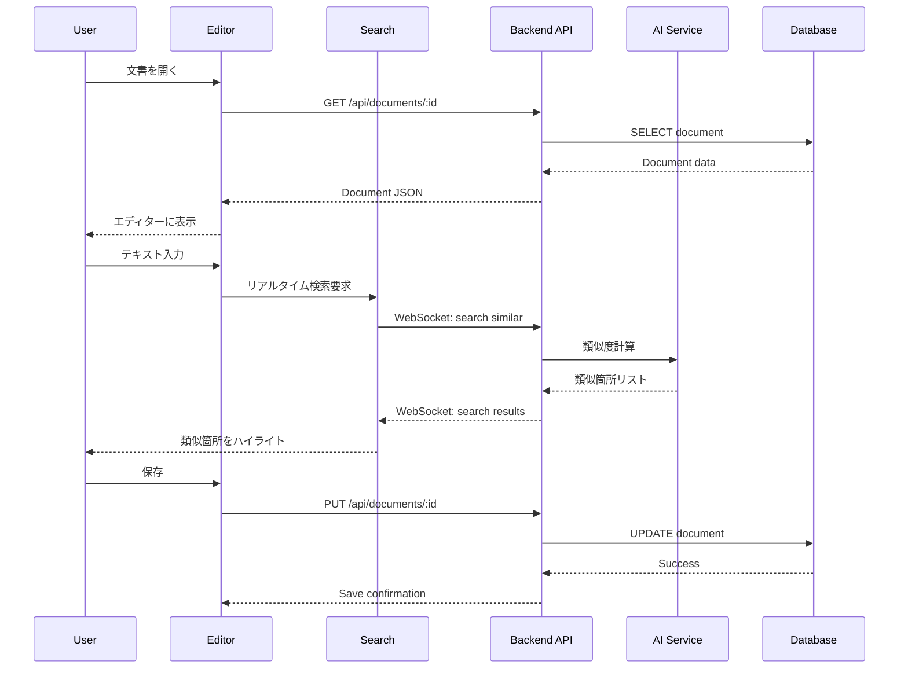
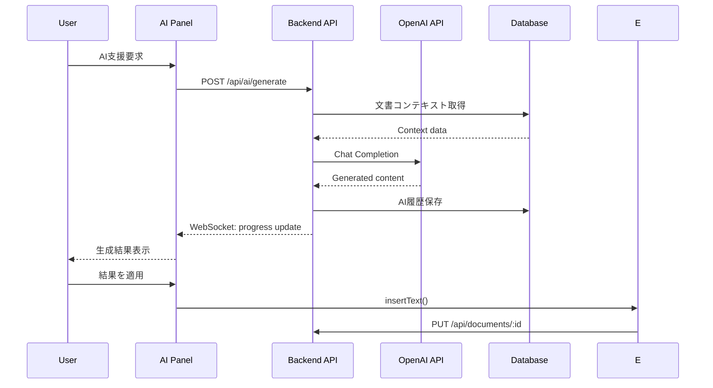

# 保険約款ドラフト作成プロトタイプ設計書

## プロジェクト概要

### プロトタイプの目的
- Clineのような類似箇所の検索・管理・編集機能の実証
- 保険約款特化のAI支援機能の検証
- ローカル環境での迅速な開発・テスト
- 最終システムへの技術的フィードバック提供

### 対象範囲
- **含む**: エディター機能、AI統合、類似検索、基本的な文書管理
- **含まない**: ユーザー管理、ワークフロー、本格的な認証、スケーラビリティ

### 技術制約
- ローカルホスト環境での動作
- 最小限の外部依存
- 迅速な開発・反復
- 商用利用を見据えたライセンス選択

## TODO管理

- [x] Phase 1: プロトタイプ技術スタック選定
  - [x] フロントエンド技術選定
  - [x] バックエンド技術選定
  - [x] データストレージ選定
  - [x] AI統合技術選定

- [x] Phase 2: シンプルアーキテクチャ設計
  - [x] 全体アーキテクチャ
  - [x] データフロー設計
  - [x] API設計

- [x] Phase 3: コア機能設計
  - [x] エディター機能設計
  - [x] 類似検索機能設計
  - [x] AI統合機能設計
  - [x] 文書管理機能設計

- [x] Phase 4: プロトタイプ実装ガイド
  - [x] 開発環境構築
  - [x] 実装手順書
  - [x] サンプルコード

-- [x] Phase 5: デモ・テスト計画
  - [x] デモシナリオ
  - [x] テストケース
  - [x] 評価指標
  - [x] プロトタイプ評価計画プ技術スタック選定

### 1.1 設計原則

#### プロトタイプ特化の原則
- **シンプルさ優先**: 最小限の技術スタックで最大の機能実現
- **迅速な開発**: セットアップ時間の最小化
- **実験容易性**: 機能の追加・変更が簡単
- **将来拡張性**: 最終システムへの移行を考慮

#### Cline類似機能の要件
- **リアルタイム検索**: 入力中の類似箇所検索
- **コンテキスト理解**: 文書構造を理解した検索
- **AI支援編集**: 自然言語での編集指示
- **差分表示**: 変更箇所の可視化

### 1.2 フロントエンド技術選定

#### 推奨構成: Vite + React + TypeScript

**Vite の選定理由**:
- **高速開発**: HMR（Hot Module Replacement）による即座の反映
- **シンプル設定**: 最小限の設定でプロジェクト開始
- **モダンツール**: ES modules ネイティブサポート
- **軽量**: Webpack比で高速なビルド

**React 18 の選定理由**:
- **豊富なエコシステム**: Monaco Editor等の統合が容易
- **開発効率**: 豊富なドキュメント・コミュニティ
- **プロトタイプ適性**: 迅速なUI構築

**TypeScript の選定理由**:
- **開発効率**: IDE支援による生産性向上
- **品質保証**: 型安全性による早期バグ発見
- **将来性**: 最終システムとの技術統一

#### UI ライブラリ: Mantine

**Mantine の選定理由**:
- **TypeScript-first**: 型安全なコンポーネント
- **豊富なコンポーネント**: エディター周辺UIの迅速構築
- **カスタマイズ性**: テーマ・スタイル調整が容易
- **軽量**: プロトタイプに適したサイズ

#### エディター: Monaco Editor

**Monaco Editor の選定理由**:
- **VSCode互換**: Clineと同等のエディター体験
- **カスタマイズ性**: 保険約款特化の機能追加
- **MIT License**: 商用利用フレンドリー
- **豊富な機能**: シンタックスハイライト、差分表示等

### 1.3 バックエンド技術選定

#### 推奨構成: Node.js + Express + TypeScript

**Node.js の選定理由**:
- **言語統一**: フロントエンドとの開発効率向上
- **豊富なライブラリ**: AI統合ライブラリの充実
- **迅速開発**: プロトタイプに適した開発速度

**Express の選定理由**:
- **シンプルさ**: 最小限の設定でAPI構築
- **柔軟性**: 必要な機能のみ追加可能
- **軽量**: プロトタイプに適したフットプリント

#### API設計: REST + WebSocket

**REST API**:
- 文書CRUD操作
- 設定管理
- ファイル操作

**WebSocket**:
- リアルタイム検索
- AI生成進捗
- エディター同期（将来拡張）

### 1.4 データストレージ選定

#### 推奨構成: SQLite + ファイルシステム

**SQLite の選定理由**:
- **ゼロ設定**: インストール・設定不要
- **軽量**: 単一ファイルでの管理
- **SQL互換**: 最終システム（PostgreSQL）への移行容易
- **ACID準拠**: データ整合性保証

**ファイルシステム**:
- **文書ファイル**: JSON形式での保存
- **添付ファイル**: ローカルディレクトリ管理
- **設定ファイル**: YAML/JSON設定

#### データ構造設計

```sql
-- 基本的なテーブル設計
CREATE TABLE documents (
    id TEXT PRIMARY KEY,
    title TEXT NOT NULL,
    content TEXT NOT NULL, -- JSON形式
    metadata TEXT, -- JSON形式
    created_at DATETIME DEFAULT CURRENT_TIMESTAMP,
    updated_at DATETIME DEFAULT CURRENT_TIMESTAMP
);

CREATE TABLE document_sections (
    id TEXT PRIMARY KEY,
    document_id TEXT REFERENCES documents(id),
    section_number TEXT NOT NULL,
    title TEXT NOT NULL,
    content TEXT NOT NULL,
    order_index INTEGER NOT NULL,
    created_at DATETIME DEFAULT CURRENT_TIMESTAMP
);

CREATE TABLE ai_interactions (
    id TEXT PRIMARY KEY,
    document_id TEXT REFERENCES documents(id),
    section_id TEXT REFERENCES document_sections(id),
    prompt TEXT NOT NULL,
    response TEXT NOT NULL,
    model_used TEXT NOT NULL,
    created_at DATETIME DEFAULT CURRENT_TIMESTAMP
);

CREATE TABLE search_cache (
    id TEXT PRIMARY KEY,
    query_hash TEXT UNIQUE NOT NULL,
    results TEXT NOT NULL, -- JSON形式
    created_at DATETIME DEFAULT CURRENT_TIMESTAMP
);
```

### 1.5 AI統合技術選定

#### 推奨構成: OpenAI API + ローカル埋め込み

**OpenAI API の選定理由**:
- **高品質**: GPT-4による高精度な生成
- **API安定性**: 商用レベルの信頼性
- **豊富な機能**: Chat Completions, Embeddings
- **プロトタイプ適性**: 迅速な統合

**ローカル埋め込み処理**:
```typescript
// 埋め込みベクトル生成・保存
interface EmbeddingService {
  generateEmbedding(text: string): Promise<number[]>;
  findSimilar(embedding: number[], threshold: number): Promise<SimilarSection[]>;
  indexDocument(document: Document): Promise<void>;
}

class OpenAIEmbeddingService implements EmbeddingService {
  async generateEmbedding(text: string): Promise<number[]> {
    const response = await openai.embeddings.create({
      model: "text-embedding-3-small",
      input: text,
    });
    return response.data[0].embedding;
  }
  
  async findSimilar(embedding: number[], threshold: number): Promise<SimilarSection[]> {
    // コサイン類似度による検索
    const similarities = await this.calculateSimilarities(embedding);
    return similarities.filter(s => s.similarity > threshold);
  }
}
```

#### AI機能の実装範囲

**Phase 1 (プロトタイプ)**:
- 基本的な文章生成
- 類似箇所検索
- 簡単な編集提案

**将来拡張**:
- 複数LLMプロバイダー対応
- 高度なRAG機能
- カスタムプロンプト管理

### 1.6 開発ツール選定

#### 推奨構成

**パッケージ管理**: npm
- Node.js標準、設定不要
- package.jsonによる依存管理

**ビルドツール**: Vite
- 高速開発サーバー
- TypeScript統合
- HMR対応

**コード品質**: ESLint + Prettier
- 一貫したコードスタイル
- 自動フォーマット

**テスト**: Vitest + React Testing Library
- Vite統合テストランナー
- 高速テスト実行

#### 開発環境構成

```json
// package.json (抜粋)
{
  "name": "policy-editor-prototype",
  "version": "0.1.0",
  "type": "module",
  "scripts": {
    "dev": "concurrently \"npm run dev:client\" \"npm run dev:server\"",
    "dev:client": "vite",
    "dev:server": "tsx watch src/server/index.ts",
    "build": "tsc && vite build",
    "test": "vitest",
    "lint": "eslint . --ext ts,tsx --report-unused-disable-directives --max-warnings 0",
    "format": "prettier --write \"src/**/*.{ts,tsx}\""
  },
  "dependencies": {
    "react": "^18.2.0",
    "react-dom": "^18.2.0",
    "@mantine/core": "^7.0.0",
    "@monaco-editor/react": "^4.6.0",
    "express": "^4.18.0",
    "sqlite3": "^5.1.0",
    "openai": "^4.0.0",
    "ws": "^8.14.0"
  },
  "devDependencies": {
    "@types/react": "^18.2.0",
    "@types/react-dom": "^18.2.0",
    "@types/express": "^4.17.0",
    "@types/ws": "^8.5.0",
    "@typescript-eslint/eslint-plugin": "^6.0.0",
    "@typescript-eslint/parser": "^6.0.0",
    "@vitejs/plugin-react": "^4.0.0",
    "concurrently": "^8.2.0",
    "eslint": "^8.45.0",
    "eslint-plugin-react-hooks": "^4.6.0",
    "eslint-plugin-react-refresh": "^0.4.0",
    "prettier": "^3.0.0",
    "tsx": "^3.12.0",
    "typescript": "^5.0.0",
    "vite": "^4.4.0",
    "vitest": "^0.34.0"
  }
}
```

### 1.7 プロジェクト構造

```
policy-editor-prototype/
├── src/
│   ├── client/                 # フロントエンド
│   │   ├── components/         # Reactコンポーネント
│   │   │   ├── Editor/         # エディター関連
│   │   │   ├── Search/         # 検索機能
│   │   │   ├── AI/             # AI機能
│   │   │   └── Common/         # 共通コンポーネント
│   │   ├── hooks/              # カスタムフック
│   │   ├── services/           # API通信
│   │   ├── types/              # 型定義
│   │   ├── utils/              # ユーティリティ
│   │   ├── App.tsx             # メインアプリ
│   │   └── main.tsx            # エントリーポイント
│   ├── server/                 # バックエンド
│   │   ├── routes/             # APIルート
│   │   ├── services/           # ビジネスロジック
│   │   ├── models/             # データモデル
│   │   ├── utils/              # ユーティリティ
│   │   └── index.ts            # サーバーエントリー
│   └── shared/                 # 共通型・ユーティリティ
│       ├── types/              # 共通型定義
│       └── constants/          # 定数
├── data/                       # ローカルデータ
│   ├── documents/              # 文書ファイル
│   ├── database.sqlite         # SQLiteデータベース
│   └── config.json             # 設定ファイル
├── public/                     # 静的ファイル
├── tests/                      # テストファイル
├── docs/                       # ドキュメント
├── package.json
├── tsconfig.json
├── vite.config.ts
└── README.md
```


## Phase 2: シンプルアーキテクチャ設計

### 2.1 全体アーキテクチャ

#### アーキテクチャ概要

```
┌─────────────────────────────────────────────────────────────┐
│                    Browser (localhost:5173)                 │
├─────────────────────────────────────────────────────────────┤
│  React Frontend                                             │
│  ┌─────────────────┐ ┌─────────────────┐ ┌─────────────────┐│
│  │   Monaco Editor │ │  Search Panel   │ │   AI Assistant  ││
│  │                 │ │                 │ │                 ││
│  │ - Syntax HL     │ │ - Similar Text  │ │ - Chat Interface││
│  │ - Auto Complete │ │ - Fuzzy Search  │ │ - Content Gen   ││
│  │ - Diff View     │ │ - Context Menu  │ │ - Edit Suggest  ││
│  └─────────────────┘ └─────────────────┘ └─────────────────┘│
└─────────────────────────────────────────────────────────────┘
                              │ HTTP/WebSocket
                              ▼
┌─────────────────────────────────────────────────────────────┐
│                Express Server (localhost:3001)              │
├─────────────────────────────────────────────────────────────┤
│  ┌─────────────────┐ ┌─────────────────┐ ┌─────────────────┐│
│  │   REST API      │ │  WebSocket      │ │   AI Service    ││
│  │                 │ │                 │ │                 ││
│  │ - CRUD Docs     │ │ - Real-time     │ │ - OpenAI API    ││
│  │ - File Upload   │ │ - Search        │ │ - Embeddings    ││
│  │ - Config        │ │ - AI Progress   │ │ - Similarity    ││
│  └─────────────────┘ └─────────────────┘ └─────────────────┘│
└─────────────────────────────────────────────────────────────┘
                              │
                              ▼
┌─────────────────────────────────────────────────────────────┐
│                    Local Storage                            │
├─────────────────────────────────────────────────────────────┤
│  ┌─────────────────┐ ┌─────────────────┐ ┌─────────────────┐│
│  │   SQLite DB     │ │  File System    │ │   Vector Cache  ││
│  │                 │ │                 │ │                 ││
│  │ - Documents     │ │ - JSON Files    │ │ - Embeddings    ││
│  │ - Sections      │ │ - Attachments   │ │ - Similarities  ││
│  │ - AI History    │ │ - Configs       │ │ - Search Cache  ││
│  └─────────────────┘ └─────────────────┘ └─────────────────┘│
└─────────────────────────────────────────────────────────────┘
```

#### 設計原則

**単一責任の分離**:
- **Frontend**: UI/UX、ユーザーインタラクション
- **Backend**: ビジネスロジック、データ管理、AI統合
- **Storage**: データ永続化、ファイル管理

**疎結合設計**:
- REST APIによる明確なインターフェース
- WebSocketによるリアルタイム通信
- 設定ファイルによる環境分離

### 2.2 データフロー設計

#### 文書編集フロー



#### AI支援フロー



### 2.3 API設計

#### REST API エンドポイント

```typescript
// 文書管理 API
interface DocumentAPI {
  // 文書一覧取得
  'GET /api/documents': {
    query: { search?: string; limit?: number; offset?: number };
    response: { documents: Document[]; total: number };
  };

  // 文書詳細取得
  'GET /api/documents/:id': {
    params: { id: string };
    response: Document;
  };

  // 文書作成
  'POST /api/documents': {
    body: CreateDocumentRequest;
    response: Document;
  };

  // 文書更新
  'PUT /api/documents/:id': {
    params: { id: string };
    body: UpdateDocumentRequest;
    response: Document;
  };

  // 文書削除
  'DELETE /api/documents/:id': {
    params: { id: string };
    response: { success: boolean };
  };
}

// AI機能 API
interface AIAPI {
  // コンテンツ生成
  'POST /api/ai/generate': {
    body: {
      documentId: string;
      sectionId?: string;
      prompt: string;
      options?: AIGenerationOptions;
    };
    response: {
      id: string;
      content: string;
      suggestions?: string[];
    };
  };

  // 類似検索
  'POST /api/ai/search': {
    body: {
      query: string;
      documentId?: string;
      threshold?: number;
    };
    response: {
      results: SimilarSection[];
    };
  };

  // AI履歴取得
  'GET /api/ai/history/:documentId': {
    params: { documentId: string };
    response: { interactions: AIInteraction[] };
  };
}

// 設定管理 API
interface ConfigAPI {
  // 設定取得
  'GET /api/config': {
    response: AppConfig;
  };

  // 設定更新
  'PUT /api/config': {
    body: Partial<AppConfig>;
    response: AppConfig;
  };
}
```

#### WebSocket イベント

```typescript
// クライアント → サーバー
interface ClientEvents {
  // リアルタイム検索
  'search:similar': {
    text: string;
    documentId: string;
    cursorPosition: number;
  };

  // AI生成開始
  'ai:generate': {
    prompt: string;
    documentId: string;
    sectionId?: string;
  };

  // 文書購読
  'document:subscribe': {
    documentId: string;
  };
}

// サーバー → クライアント
interface ServerEvents {
  // 検索結果
  'search:results': {
    results: SimilarSection[];
    queryId: string;
  };

  // AI生成進捗
  'ai:progress': {
    generationId: string;
    progress: number;
    status: 'generating' | 'complete' | 'error';
  };

  // AI生成完了
  'ai:complete': {
    generationId: string;
    content: string;
    suggestions?: string[];
  };

  // エラー通知
  'error': {
    message: string;
    code: string;
  };
}
```

### 2.4 データモデル設計

#### 型定義

```typescript
// 基本的なドメインモデル
interface Document {
  id: string;
  title: string;
  content: DocumentContent;
  metadata: DocumentMetadata;
  createdAt: Date;
  updatedAt: Date;
}

interface DocumentContent {
  sections: Section[];
  format: 'structured' | 'plain';
}

interface Section {
  id: string;
  type: 'article' | 'clause' | 'paragraph' | 'note';
  number?: string; // 第1条、1項 など
  title: string;
  content: string;
  order: number;
  children?: Section[];
}

interface DocumentMetadata {
  category: string; // 自動車保険、生命保険 など
  version: string;
  tags: string[];
  language: 'ja' | 'en';
  wordCount: number;
  lastEditedBy?: string;
}

// AI関連モデル
interface AIInteraction {
  id: string;
  documentId: string;
  sectionId?: string;
  prompt: string;
  response: string;
  model: string;
  tokensUsed: number;
  createdAt: Date;
}

interface SimilarSection {
  sectionId: string;
  documentId: string;
  title: string;
  content: string;
  similarity: number;
  context: {
    beforeText: string;
    afterText: string;
  };
}

// 検索・埋め込み関連
interface EmbeddingVector {
  id: string;
  sectionId: string;
  documentId: string;
  text: string;
  vector: number[];
  createdAt: Date;
}

// 設定モデル
interface AppConfig {
  ai: {
    provider: 'openai' | 'anthropic' | 'local';
    model: string;
    apiKey?: string;
    temperature: number;
    maxTokens: number;
  };
  editor: {
    theme: 'light' | 'dark';
    fontSize: number;
    wordWrap: boolean;
    minimap: boolean;
  };
  search: {
    similarityThreshold: number;
    maxResults: number;
    enableRealtime: boolean;
  };
}
```

### 2.5 ファイル構成詳細

#### フロントエンド構成

```typescript
// src/client/components/Editor/PolicyEditor.tsx
interface PolicyEditorProps {
  document: Document;
  onDocumentChange: (document: Document) => void;
  onSave: () => void;
}

export const PolicyEditor: React.FC<PolicyEditorProps> = ({
  document,
  onDocumentChange,
  onSave
}) => {
  const [editorContent, setEditorContent] = useState('');
  const [similarSections, setSimilarSections] = useState<SimilarSection[]>([]);
  
  // Monaco Editor設定
  const editorOptions = {
    theme: 'vs-light',
    language: 'policy-lang', // カスタム言語定義
    wordWrap: 'on',
    minimap: { enabled: false },
    scrollBeyondLastLine: false,
  };

  // リアルタイム類似検索
  const handleContentChange = useCallback(
    debounce((value: string) => {
      setEditorContent(value);
      searchSimilarSections(value);
    }, 300),
    []
  );

  return (
    <div className="policy-editor">
      <EditorToolbar onSave={onSave} />
      <div className="editor-container">
        <MonacoEditor
          value={editorContent}
          onChange={handleContentChange}
          options={editorOptions}
        />
        <SimilarSectionsPanel sections={similarSections} />
      </div>
      <AIAssistantPanel documentId={document.id} />
    </div>
  );
};

// src/client/components/Search/SimilarSectionsPanel.tsx
interface SimilarSectionsPanelProps {
  sections: SimilarSection[];
}

export const SimilarSectionsPanel: React.FC<SimilarSectionsPanelProps> = ({
  sections
}) => {
  return (
    <div className="similar-sections-panel">
      <h3>類似箇所</h3>
      {sections.map(section => (
        <SimilarSectionCard
          key={section.sectionId}
          section={section}
          onInsert={() => insertSection(section)}
        />
      ))}
    </div>
  );
};

// src/client/components/AI/AIAssistantPanel.tsx
interface AIAssistantPanelProps {
  documentId: string;
}

export const AIAssistantPanel: React.FC<AIAssistantPanelProps> = ({
  documentId
}) => {
  const [messages, setMessages] = useState<ChatMessage[]>([]);
  const [isGenerating, setIsGenerating] = useState(false);

  const handleSendMessage = async (prompt: string) => {
    setIsGenerating(true);
    try {
      const response = await aiService.generateContent({
        documentId,
        prompt,
      });
      setMessages(prev => [...prev, response]);
    } finally {
      setIsGenerating(false);
    }
  };

  return (
    <div className="ai-assistant-panel">
      <ChatHistory messages={messages} />
      <ChatInput onSend={handleSendMessage} disabled={isGenerating} />
    </div>
  );
};
```

#### バックエンド構成

```typescript
// src/server/routes/documents.ts
import express from 'express';
import { DocumentService } from '../services/DocumentService';

const router = express.Router();
const documentService = new DocumentService();

// 文書一覧取得
router.get('/', async (req, res) => {
  try {
    const { search, limit = 20, offset = 0 } = req.query;
    const result = await documentService.getDocuments({
      search: search as string,
      limit: Number(limit),
      offset: Number(offset),
    });
    res.json(result);
  } catch (error) {
    res.status(500).json({ error: error.message });
  }
});

// 文書詳細取得
router.get('/:id', async (req, res) => {
  try {
    const document = await documentService.getDocument(req.params.id);
    if (!document) {
      return res.status(404).json({ error: 'Document not found' });
    }
    res.json(document);
  } catch (error) {
    res.status(500).json({ error: error.message });
  }
});

// 文書更新
router.put('/:id', async (req, res) => {
  try {
    const document = await documentService.updateDocument(
      req.params.id,
      req.body
    );
    res.json(document);
  } catch (error) {
    res.status(500).json({ error: error.message });
  }
});

export default router;

// src/server/services/DocumentService.ts
export class DocumentService {
  constructor(
    private db: Database,
    private embeddingService: EmbeddingService
  ) {}

  async getDocuments(options: GetDocumentsOptions): Promise<GetDocumentsResult> {
    const { search, limit, offset } = options;
    
    let query = 'SELECT * FROM documents';
    const params: any[] = [];
    
    if (search) {
      query += ' WHERE title LIKE ? OR content LIKE ?';
      params.push(`%${search}%`, `%${search}%`);
    }
    
    query += ' ORDER BY updated_at DESC LIMIT ? OFFSET ?';
    params.push(limit, offset);
    
    const documents = await this.db.all(query, params);
    const total = await this.getDocumentsCount(search);
    
    return {
      documents: documents.map(this.mapToDocument),
      total,
    };
  }

  async updateDocument(id: string, updates: Partial<Document>): Promise<Document> {
    const document = await this.getDocument(id);
    if (!document) {
      throw new Error('Document not found');
    }

    const updatedDocument = { ...document, ...updates, updatedAt: new Date() };
    
    await this.db.run(
      'UPDATE documents SET title = ?, content = ?, metadata = ?, updated_at = ? WHERE id = ?',
      [
        updatedDocument.title,
        JSON.stringify(updatedDocument.content),
        JSON.stringify(updatedDocument.metadata),
        updatedDocument.updatedAt.toISOString(),
        id,
      ]
    );

    // 埋め込みベクトルの更新
    await this.embeddingService.updateDocumentEmbeddings(updatedDocument);

    return updatedDocument;
  }
}

// src/server/services/AIService.ts
export class AIService {
  constructor(
    private openai: OpenAI,
    private embeddingService: EmbeddingService
  ) {}

  async generateContent(request: GenerateContentRequest): Promise<GenerateContentResponse> {
    const { documentId, sectionId, prompt } = request;
    
    // コンテキスト取得
    const context = await this.getDocumentContext(documentId, sectionId);
    
    // プロンプト構築
    const systemPrompt = this.buildSystemPrompt(context);
    
    // OpenAI API呼び出し
    const completion = await this.openai.chat.completions.create({
      model: 'gpt-4',
      messages: [
        { role: 'system', content: systemPrompt },
        { role: 'user', content: prompt },
      ],
      temperature: 0.7,
      max_tokens: 1000,
    });

    const content = completion.choices[0].message.content;
    
    // 履歴保存
    await this.saveInteraction({
      documentId,
      sectionId,
      prompt,
      response: content,
      model: 'gpt-4',
      tokensUsed: completion.usage?.total_tokens || 0,
    });

    return {
      id: generateId(),
      content,
      suggestions: await this.generateSuggestions(content),
    };
  }

  async searchSimilarSections(query: string, options: SearchOptions = {}): Promise<SimilarSection[]> {
    const queryEmbedding = await this.embeddingService.generateEmbedding(query);
    return this.embeddingService.findSimilar(queryEmbedding, options.threshold || 0.8);
  }
}
```


## Phase 3: コア機能設計

### 3.1 エディター機能設計

#### Cline風エディター体験の実現

**Monaco Editor カスタマイズ**:

```typescript
// 保険約款専用言語定義
export const policyLanguageDefinition = {
  id: 'policy-lang',
  extensions: ['.policy'],
  aliases: ['Policy', 'policy'],
  mimetypes: ['text/policy'],
};

// 保険約款用トークナイザー
export const policyTokenizer = {
  tokenizer: {
    root: [
      // 条項番号（第1条、第2条など）
      [/第\d+条/, 'article-number'],
      
      // 項番号（1項、2項など）
      [/\d+項/, 'paragraph-number'],
      
      // 号番号（(1)、(2)など）
      [/\(\d+\)/, 'item-number'],
      
      // 括弧内説明（用語定義など）
      [/（[^）]+）/, 'definition'],
      
      // 引用符内テキスト
      [/「[^」]+」/, 'quoted-text'],
      
      // 法的用語
      [/\b(責任|義務|権利|補償|免責|約款|契約|保険|被保険者|保険者|保険金|損害)\b/, 'legal-term'],
      
      // 金額表記
      [/\d+(?:,\d{3})*円/, 'amount'],
      
      // 日付表記
      [/\d{4}年\d{1,2}月\d{1,2}日/, 'date'],
      
      // 期間表記
      [/\d+(?:年|ヶ月|日|時間)/, 'period'],
    ],
  },
};

// カスタムテーマ定義
export const policyTheme = {
  base: 'vs',
  inherit: true,
  rules: [
    { token: 'article-number', foreground: '0066cc', fontStyle: 'bold' },
    { token: 'paragraph-number', foreground: '008800', fontStyle: 'bold' },
    { token: 'item-number', foreground: '666666' },
    { token: 'definition', foreground: '666666', fontStyle: 'italic' },
    { token: 'quoted-text', foreground: 'cc6600' },
    { token: 'legal-term', foreground: 'cc0000', fontStyle: 'bold' },
    { token: 'amount', foreground: '9900cc' },
    { token: 'date', foreground: '009999' },
    { token: 'period', foreground: '009999' },
  ],
  colors: {
    'editor.background': '#fafafa',
    'editor.lineHighlightBackground': '#f0f8ff',
    'editorLineNumber.foreground': '#999999',
    'editor.selectionBackground': '#add6ff',
  },
};

// エディター初期化
export const initializePolicyEditor = (container: HTMLElement) => {
  // 言語とテーマの登録
  monaco.languages.register(policyLanguageDefinition);
  monaco.languages.setMonarchTokensProvider('policy-lang', policyTokenizer);
  monaco.editor.defineTheme('policy-theme', policyTheme);

  // エディター作成
  const editor = monaco.editor.create(container, {
    language: 'policy-lang',
    theme: 'policy-theme',
    wordWrap: 'on',
    lineNumbers: 'on',
    minimap: { enabled: false },
    scrollBeyondLastLine: false,
    automaticLayout: true,
    fontSize: 14,
    lineHeight: 22,
    padding: { top: 16, bottom: 16 },
  });

  return editor;
};
```

#### リアルタイム類似検索の実装

```typescript
// 類似検索エンジン
export class SimilaritySearchEngine {
  private debounceTimer: NodeJS.Timeout | null = null;
  private currentQuery = '';
  
  constructor(
    private wsClient: WebSocketClient,
    private onResults: (results: SimilarSection[]) => void
  ) {}

  // リアルタイム検索（デバウンス付き）
  searchSimilar(text: string, cursorPosition: number): void {
    if (this.debounceTimer) {
      clearTimeout(this.debounceTimer);
    }

    this.debounceTimer = setTimeout(() => {
      this.performSearch(text, cursorPosition);
    }, 300); // 300ms のデバウンス
  }

  private async performSearch(text: string, cursorPosition: number): Promise<void> {
    // 現在の段落を抽出
    const currentParagraph = this.extractCurrentParagraph(text, cursorPosition);
    
    if (currentParagraph.length < 10) {
      this.onResults([]);
      return;
    }

    // WebSocket経由で検索要求
    this.wsClient.emit('search:similar', {
      text: currentParagraph,
      documentId: this.currentDocumentId,
      cursorPosition,
    });
  }

  // 現在の段落を抽出
  private extractCurrentParagraph(text: string, cursorPosition: number): string {
    const lines = text.split('\n');
    let currentLine = 0;
    let charCount = 0;

    // カーソル位置の行を特定
    for (let i = 0; i < lines.length; i++) {
      if (charCount + lines[i].length >= cursorPosition) {
        currentLine = i;
        break;
      }
      charCount += lines[i].length + 1; // +1 for newline
    }

    // 段落の開始と終了を特定
    let startLine = currentLine;
    let endLine = currentLine;

    // 上方向に空行まで検索
    while (startLine > 0 && lines[startLine - 1].trim() !== '') {
      startLine--;
    }

    // 下方向に空行まで検索
    while (endLine < lines.length - 1 && lines[endLine + 1].trim() !== '') {
      endLine++;
    }

    return lines.slice(startLine, endLine + 1).join('\n').trim();
  }
}

// 類似箇所ハイライト機能
export class SimilarityHighlighter {
  private decorations: string[] = [];

  constructor(private editor: monaco.editor.IStandaloneCodeEditor) {}

  // 類似箇所をハイライト
  highlightSimilarSections(results: SimilarSection[]): void {
    // 既存のハイライトをクリア
    this.clearHighlights();

    const newDecorations: monaco.editor.IModelDeltaDecoration[] = [];

    results.forEach((result, index) => {
      const range = this.findTextRange(result.content);
      if (range) {
        newDecorations.push({
          range,
          options: {
            className: `similar-highlight similarity-${this.getSimilarityLevel(result.similarity)}`,
            hoverMessage: {
              value: `類似度: ${(result.similarity * 100).toFixed(1)}%\n文書: ${result.title}`,
            },
            minimap: {
              color: this.getSimilarityColor(result.similarity),
              position: monaco.editor.MinimapPosition.Inline,
            },
          },
        });
      }
    });

    this.decorations = this.editor.deltaDecorations([], newDecorations);
  }

  private getSimilarityLevel(similarity: number): string {
    if (similarity > 0.9) return 'high';
    if (similarity > 0.7) return 'medium';
    return 'low';
  }

  private getSimilarityColor(similarity: number): string {
    if (similarity > 0.9) return '#ff6b6b';
    if (similarity > 0.7) return '#ffa726';
    return '#66bb6a';
  }

  clearHighlights(): void {
    this.decorations = this.editor.deltaDecorations(this.decorations, []);
  }
}
```

### 3.2 類似検索機能設計

#### 埋め込みベクトル生成・管理

```typescript
// 埋め込みベクトル管理サービス
export class EmbeddingService {
  private vectorCache = new Map<string, number[]>();
  
  constructor(
    private openai: OpenAI,
    private database: Database
  ) {}

  // テキストの埋め込みベクトル生成
  async generateEmbedding(text: string): Promise<number[]> {
    const cacheKey = this.getCacheKey(text);
    
    // キャッシュチェック
    if (this.vectorCache.has(cacheKey)) {
      return this.vectorCache.get(cacheKey)!;
    }

    try {
      const response = await this.openai.embeddings.create({
        model: 'text-embedding-3-small',
        input: this.preprocessText(text),
      });

      const embedding = response.data[0].embedding;
      
      // キャッシュに保存
      this.vectorCache.set(cacheKey, embedding);
      
      return embedding;
    } catch (error) {
      console.error('Embedding generation failed:', error);
      throw new Error('Failed to generate embedding');
    }
  }

  // 文書全体のインデックス化
  async indexDocument(document: Document): Promise<void> {
    const chunks = this.chunkDocument(document);
    
    for (const chunk of chunks) {
      const embedding = await this.generateEmbedding(chunk.text);
      
      await this.database.run(
        `INSERT OR REPLACE INTO document_embeddings 
         (id, document_id, section_id, chunk_index, content, embedding, metadata, created_at)
         VALUES (?, ?, ?, ?, ?, ?, ?, ?)`,
        [
          chunk.id,
          document.id,
          chunk.sectionId,
          chunk.index,
          chunk.text,
          JSON.stringify(embedding),
          JSON.stringify(chunk.metadata),
          new Date().toISOString(),
        ]
      );
    }
  }

  // 文書のチャンク分割（境界情報を失わないように）
  private chunkDocument(document: Document): DocumentChunk[] {
    const chunks: DocumentChunk[] = [];
    const chunkSize = 500; // 文字数
    const overlap = 100; // オーバーラップ

    document.content.sections.forEach((section, sectionIndex) => {
      const sectionText = `${section.title}\n${section.content}`;
      
      if (sectionText.length <= chunkSize) {
        // セクション全体が1チャンクに収まる場合
        chunks.push({
          id: `${document.id}-${section.id}-0`,
          documentId: document.id,
          sectionId: section.id,
          index: chunks.length,
          text: sectionText,
          metadata: {
            sectionTitle: section.title,
            sectionType: section.type,
            sectionNumber: section.number,
          },
        });
      } else {
        // セクションを複数チャンクに分割
        let startPos = 0;
        let chunkIndex = 0;

        while (startPos < sectionText.length) {
          const endPos = Math.min(startPos + chunkSize, sectionText.length);
          const chunkText = sectionText.substring(startPos, endPos);

          chunks.push({
            id: `${document.id}-${section.id}-${chunkIndex}`,
            documentId: document.id,
            sectionId: section.id,
            index: chunks.length,
            text: chunkText,
            metadata: {
              sectionTitle: section.title,
              sectionType: section.type,
              sectionNumber: section.number,
              chunkIndex,
              isPartial: true,
            },
          });

          startPos += chunkSize - overlap;
          chunkIndex++;
        }
      }
    });

    return chunks;
  }

  // 類似検索実行
  async findSimilar(
    queryEmbedding: number[],
    options: SimilaritySearchOptions = {}
  ): Promise<SimilarSection[]> {
    const {
      threshold = 0.7,
      maxResults = 10,
      excludeDocumentId,
    } = options;

    // データベースから全ての埋め込みベクトルを取得
    let query = `
      SELECT e.*, d.title as document_title
      FROM document_embeddings e
      JOIN documents d ON e.document_id = d.id
    `;
    const params: any[] = [];

    if (excludeDocumentId) {
      query += ' WHERE e.document_id != ?';
      params.push(excludeDocumentId);
    }

    const embeddings = await this.database.all(query, params);

    // コサイン類似度計算
    const similarities = embeddings
      .map(row => ({
        ...row,
        embedding: JSON.parse(row.embedding),
        similarity: this.cosineSimilarity(queryEmbedding, JSON.parse(row.embedding)),
      }))
      .filter(item => item.similarity >= threshold)
      .sort((a, b) => b.similarity - a.similarity)
      .slice(0, maxResults);

    // 結果をSimilarSection形式に変換
    return similarities.map(item => ({
      sectionId: item.section_id,
      documentId: item.document_id,
      title: item.document_title,
      content: item.content,
      similarity: item.similarity,
      context: {
        beforeText: '', // 必要に応じて前後のテキストを取得
        afterText: '',
      },
      metadata: JSON.parse(item.metadata || '{}'),
    }));
  }

  // コサイン類似度計算
  private cosineSimilarity(vecA: number[], vecB: number[]): number {
    if (vecA.length !== vecB.length) {
      throw new Error('Vector dimensions must match');
    }

    let dotProduct = 0;
    let normA = 0;
    let normB = 0;

    for (let i = 0; i < vecA.length; i++) {
      dotProduct += vecA[i] * vecB[i];
      normA += vecA[i] * vecA[i];
      normB += vecB[i] * vecB[i];
    }

    return dotProduct / (Math.sqrt(normA) * Math.sqrt(normB));
  }

  // テキスト前処理
  private preprocessText(text: string): string {
    return text
      .replace(/\s+/g, ' ') // 連続する空白を1つに
      .replace(/[（）]/g, '') // 全角括弧を除去
      .trim();
  }

  private getCacheKey(text: string): string {
    return Buffer.from(text).toString('base64').substring(0, 32);
  }
}

interface DocumentChunk {
  id: string;
  documentId: string;
  sectionId: string;
  index: number;
  text: string;
  metadata: {
    sectionTitle: string;
    sectionType: string;
    sectionNumber?: string;
    chunkIndex?: number;
    isPartial?: boolean;
  };
}

interface SimilaritySearchOptions {
  threshold?: number;
  maxResults?: number;
  excludeDocumentId?: string;
  sectionTypes?: string[];
}
```

### 3.3 AI統合機能設計

#### 保険約款特化のAI機能

```typescript
// 保険約款専用AIサービス
export class PolicyAIService {
  constructor(
    private openai: OpenAI,
    private embeddingService: EmbeddingService
  ) {}

  // 条項生成
  async generateClause(request: GenerateClauseRequest): Promise<GenerateClauseResponse> {
    const { type, description, context, options = {} } = request;

    const systemPrompt = this.buildClauseSystemPrompt(type, context);
    const userPrompt = this.buildClauseUserPrompt(description, options);

    try {
      const completion = await this.openai.chat.completions.create({
        model: 'gpt-4o-mini', // 推奨モデル
        messages: [
          { role: 'system', content: systemPrompt },
          { role: 'user', content: userPrompt },
        ],
        temperature: options.temperature || 0.3,
        max_tokens: options.maxTokens || 1000,
      });

      const generatedText = completion.choices[0].message.content || '';
      
      // 生成結果の後処理
      const processedClause = this.postProcessClause(generatedText, type);
      
      // 関連条項の提案
      const relatedClauses = await this.suggestRelatedClauses(processedClause);

      return {
        id: generateId(),
        content: processedClause,
        type,
        relatedClauses,
        metadata: {
          model: 'gpt-4o-mini',
          tokensUsed: completion.usage?.total_tokens || 0,
          generatedAt: new Date(),
        },
      };
    } catch (error) {
      throw new Error(`Clause generation failed: ${error.message}`);
    }
  }

  // 条項改善提案
  async improveClause(request: ImproveClauseRequest): Promise<ImproveClauseResponse> {
    const { originalText, improvementType, context } = request;

    const systemPrompt = `
あなたは保険約款の専門家です。以下の条項を${improvementType}の観点から改善してください。

改善の観点:
- 明確性: 曖昧な表現を具体的に
- 簡潔性: 冗長な表現を簡潔に
- 法的正確性: 法的に正確な表現に
- 読みやすさ: 一般の人にも理解しやすく

出力形式:
1. 改善された条項
2. 変更点の説明
3. 改善理由
`;

    const userPrompt = `
【元の条項】
${originalText}

【コンテキスト】
${context || '特になし'}

上記の条項を改善してください。
`;

    const completion = await this.openai.chat.completions.create({
      model: 'gpt-4o-mini',
      messages: [
        { role: 'system', content: systemPrompt },
        { role: 'user', content: userPrompt },
      ],
      temperature: 0.2,
    });

    const response = completion.choices[0].message.content || '';
    
    return this.parseImprovementResponse(response);
  }

  // 法的リスク分析
  async analyzeLegalRisk(text: string): Promise<LegalRiskAnalysis> {
    const systemPrompt = `
あなたは保険法の専門家です。提供された条項の法的リスクを分析してください。

分析項目:
1. 法的有効性
2. 消費者保護法への適合性
3. 曖昧性のリスク
4. 実務上の問題点
5. 改善提案

リスクレベル: HIGH/MEDIUM/LOW で評価してください。
`;

    const completion = await this.openai.chat.completions.create({
      model: 'gpt-4o-mini',
      messages: [
        { role: 'system', content: systemPrompt },
        { role: 'user', content: text },
      ],
      temperature: 0.1,
    });

    return this.parseLegalRiskResponse(completion.choices[0].message.content || '');
  }

  // 類似条項の提案
  private async suggestRelatedClauses(clause: string): Promise<RelatedClause[]> {
    const embedding = await this.embeddingService.generateEmbedding(clause);
    const similarSections = await this.embeddingService.findSimilar(embedding, {
      threshold: 0.6,
      maxResults: 5,
    });

    return similarSections.map(section => ({
      id: section.sectionId,
      title: section.title,
      content: section.content,
      similarity: section.similarity,
      source: section.documentId,
    }));
  }

  // 条項タイプ別システムプロンプト構築
  private buildClauseSystemPrompt(type: ClauseType, context?: string): string {
    const basePrompt = `
あなたは保険約款作成の専門家です。日本の保険業法および関連法規に準拠した条項を作成してください。

基本原則:
- 法的に正確で有効な表現を使用
- 明確で理解しやすい日本語
- 保険業界の標準的な用語を使用
- 消費者保護の観点を考慮
`;

    const typeSpecificPrompts = {
      liability: `
【責任条項の作成】
- 保険者の責任範囲を明確に定義
- 免責事由を具体的に列挙
- 責任限度額を適切に設定
`,
      coverage: `
【補償条項の作成】
- 補償対象を具体的に定義
- 補償範囲と除外事項を明確化
- 支払条件を詳細に規定
`,
      procedure: `
【手続条項の作成】
- 手続きの流れを時系列で整理
- 必要書類を具体的に列挙
- 期限と責任を明確化
`,
      definition: `
【定義条項の作成】
- 用語の意味を正確に定義
- 他の条項との整合性を確保
- 業界標準の定義を参考
`,
    };

    let prompt = basePrompt + (typeSpecificPrompts[type] || '');
    
    if (context) {
      prompt += `\n【コンテキスト】\n${context}\n`;
    }

    return prompt;
  }

  private buildClauseUserPrompt(description: string, options: any): string {
    return `
以下の要件に基づいて条項を作成してください:

【要件】
${description}

【出力形式】
条項番号: 第○条（条項名）
条項内容: （具体的な条項文）

${options.includeExplanation ? '【解説】\n（条項の意図と適用場面の説明）' : ''}
`;
  }

  private postProcessClause(text: string, type: ClauseType): string {
    // 条項番号の正規化
    text = text.replace(/第(\d+)条/, '第$1条');
    
    // 項番号の正規化
    text = text.replace(/(\d+)項/, '$1項');
    
    // 号番号の正規化
    text = text.replace(/\((\d+)\)/, '($1)');
    
    // 不要な空行の除去
    text = text.replace(/\n\s*\n\s*\n/g, '\n\n');
    
    return text.trim();
  }

  private parseImprovementResponse(response: string): ImproveClauseResponse {
    // レスポンスをパースして構造化
    const sections = response.split(/\d+\.\s+/);
    
    return {
      improvedText: sections[1]?.trim() || '',
      changes: sections[2]?.trim() || '',
      reasoning: sections[3]?.trim() || '',
      confidence: 0.8, // 実際の実装では信頼度を計算
    };
  }

  private parseLegalRiskResponse(response: string): LegalRiskAnalysis {
    // レスポンスをパースしてリスク分析結果を構造化
    const riskLevel = this.extractRiskLevel(response);
    const issues = this.extractIssues(response);
    const recommendations = this.extractRecommendations(response);

    return {
      overallRisk: riskLevel,
      issues,
      recommendations,
      analysisDate: new Date(),
    };
  }

  private extractRiskLevel(text: string): 'HIGH' | 'MEDIUM' | 'LOW' {
    if (text.includes('HIGH')) return 'HIGH';
    if (text.includes('MEDIUM')) return 'MEDIUM';
    return 'LOW';
  }

  private extractIssues(text: string): string[] {
    // 問題点を抽出するロジック
    const issuePattern = /[・•]\s*(.+)/g;
    const issues: string[] = [];
    let match;
    
    while ((match = issuePattern.exec(text)) !== null) {
      issues.push(match[1].trim());
    }
    
    return issues;
  }

  private extractRecommendations(text: string): string[] {
    // 改善提案を抽出するロジック
    return this.extractIssues(text); // 簡略化
  }
}

// 型定義
type ClauseType = 'liability' | 'coverage' | 'procedure' | 'definition';

interface GenerateClauseRequest {
  type: ClauseType;
  description: string;
  context?: string;
  options?: {
    temperature?: number;
    maxTokens?: number;
    includeExplanation?: boolean;
  };
}

interface GenerateClauseResponse {
  id: string;
  content: string;
  type: ClauseType;
  relatedClauses: RelatedClause[];
  metadata: {
    model: string;
    tokensUsed: number;
    generatedAt: Date;
  };
}

interface ImproveClauseRequest {
  originalText: string;
  improvementType: 'clarity' | 'conciseness' | 'legal-accuracy' | 'readability';
  context?: string;
}

interface ImproveClauseResponse {
  improvedText: string;
  changes: string;
  reasoning: string;
  confidence: number;
}

interface LegalRiskAnalysis {
  overallRisk: 'HIGH' | 'MEDIUM' | 'LOW';
  issues: string[];
  recommendations: string[];
  analysisDate: Date;
}

interface RelatedClause {
  id: string;
  title: string;
  content: string;
  similarity: number;
  source: string;
}
```

### 3.4 文書管理機能設計

#### 文書構造管理

```typescript
// 文書構造管理サービス
export class DocumentStructureService {
  constructor(private database: Database) {}

  // 文書構造の解析・正規化
  async analyzeDocumentStructure(content: string): Promise<DocumentStructure> {
    const sections = this.parseDocumentSections(content);
    const hierarchy = this.buildHierarchy(sections);
    const metadata = this.extractMetadata(content, sections);

    return {
      sections: hierarchy,
      metadata,
      statistics: this.calculateStatistics(sections),
    };
  }

  // セクション解析
  private parseDocumentSections(content: string): ParsedSection[] {
    const lines = content.split('\n');
    const sections: ParsedSection[] = [];
    let currentSection: ParsedSection | null = null;

    for (let i = 0; i < lines.length; i++) {
      const line = lines[i].trim();
      
      // 条項の検出（第1条、第2条など）
      const articleMatch = line.match(/^第(\d+)条\s*（([^）]+)）/);
      if (articleMatch) {
        if (currentSection) {
          sections.push(currentSection);
        }
        
        currentSection = {
          id: generateId(),
          type: 'article',
          number: articleMatch[1],
          title: articleMatch[2],
          content: '',
          order: sections.length,
          lineStart: i,
          lineEnd: i,
          children: [],
        };
        continue;
      }

      // 項の検出（1項、2項など）
      const paragraphMatch = line.match(/^(\d+)項?\s+(.+)/);
      if (paragraphMatch && currentSection) {
        const paragraph: ParsedSection = {
          id: generateId(),
          type: 'paragraph',
          number: paragraphMatch[1],
          title: '',
          content: paragraphMatch[2],
          order: currentSection.children.length,
          lineStart: i,
          lineEnd: i,
          children: [],
        };
        
        currentSection.children.push(paragraph);
        continue;
      }

      // 号の検出（(1)、(2)など）
      const itemMatch = line.match(/^\((\d+)\)\s*(.+)/);
      if (itemMatch && currentSection && currentSection.children.length > 0) {
        const lastParagraph = currentSection.children[currentSection.children.length - 1];
        const item: ParsedSection = {
          id: generateId(),
          type: 'item',
          number: itemMatch[1],
          title: '',
          content: itemMatch[2],
          order: lastParagraph.children.length,
          lineStart: i,
          lineEnd: i,
          children: [],
        };
        
        lastParagraph.children.push(item);
        continue;
      }

      // 通常のテキスト
      if (currentSection && line) {
        currentSection.content += (currentSection.content ? '\n' : '') + line;
        currentSection.lineEnd = i;
      }
    }

    if (currentSection) {
      sections.push(currentSection);
    }

    return sections;
  }

  // 階層構造の構築
  private buildHierarchy(sections: ParsedSection[]): Section[] {
    return sections.map(section => ({
      id: section.id,
      type: section.type,
      number: section.number,
      title: section.title,
      content: section.content,
      order: section.order,
      children: this.buildHierarchy(section.children),
    }));
  }

  // メタデータ抽出
  private extractMetadata(content: string, sections: ParsedSection[]): DocumentMetadata {
    const wordCount = content.replace(/\s+/g, '').length;
    const articleCount = sections.filter(s => s.type === 'article').length;
    
    // カテゴリ推定
    const category = this.estimateCategory(content);
    
    // 言語検出
    const language = this.detectLanguage(content);

    return {
      category,
      version: '1.0',
      tags: this.extractTags(content),
      language,
      wordCount,
      statistics: {
        articleCount,
        paragraphCount: this.countByType(sections, 'paragraph'),
        itemCount: this.countByType(sections, 'item'),
      },
    };
  }

  // カテゴリ推定
  private estimateCategory(content: string): string {
    const keywords = {
      '自動車保険': ['自動車', '車両', '対人', '対物', '人身傷害'],
      '生命保険': ['死亡', '生存', '満期', '解約返戻金'],
      '医療保険': ['入院', '手術', '通院', '診療'],
      '火災保険': ['火災', '風災', '水災', '盗難'],
      '地震保険': ['地震', '噴火', '津波'],
    };

    let maxScore = 0;
    let estimatedCategory = '一般';

    for (const [category, terms] of Object.entries(keywords)) {
      const score = terms.reduce((acc, term) => {
        const count = (content.match(new RegExp(term, 'g')) || []).length;
        return acc + count;
      }, 0);

      if (score > maxScore) {
        maxScore = score;
        estimatedCategory = category;
      }
    }

    return estimatedCategory;
  }

  // 言語検出
  private detectLanguage(content: string): 'ja' | 'en' {
    const japaneseChars = content.match(/[\u3040-\u309F\u30A0-\u30FF\u4E00-\u9FAF]/g);
    const japaneseRatio = japaneseChars ? japaneseChars.length / content.length : 0;
    
    return japaneseRatio > 0.3 ? 'ja' : 'en';
  }

  // タグ抽出
  private extractTags(content: string): string[] {
    const commonTerms = [
      '責任', '補償', '免責', '保険金', '保険料', '契約', '約款',
      '被保険者', '保険者', '損害', '事故', '請求', '支払'
    ];

    return commonTerms.filter(term => content.includes(term));
  }

  // 統計計算
  private calculateStatistics(sections: ParsedSection[]): DocumentStatistics {
    return {
      totalSections: sections.length,
      averageSectionLength: sections.reduce((acc, s) => acc + s.content.length, 0) / sections.length,
      maxDepth: this.calculateMaxDepth(sections),
      complexity: this.calculateComplexity(sections),
    };
  }

  private countByType(sections: ParsedSection[], type: string): number {
    return sections.reduce((count, section) => {
      let typeCount = section.type === type ? 1 : 0;
      typeCount += this.countByType(section.children, type);
      return count + typeCount;
    }, 0);
  }

  private calculateMaxDepth(sections: ParsedSection[], currentDepth = 1): number {
    if (sections.length === 0) return currentDepth - 1;
    
    return Math.max(
      ...sections.map(section => 
        this.calculateMaxDepth(section.children, currentDepth + 1)
      )
    );
  }

  private calculateComplexity(sections: ParsedSection[]): number {
    // 複雑度の計算（セクション数、階層の深さ、平均文長などを考慮）
    const sectionCount = this.countByType(sections, 'article');
    const maxDepth = this.calculateMaxDepth(sections);
    const avgLength = sections.reduce((acc, s) => acc + s.content.length, 0) / sections.length;
    
    return Math.round((sectionCount * 0.3 + maxDepth * 0.4 + avgLength * 0.0001) * 10) / 10;
  }
}

// 型定義
interface ParsedSection {
  id: string;
  type: 'article' | 'paragraph' | 'item' | 'note';
  number?: string;
  title: string;
  content: string;
  order: number;
  lineStart: number;
  lineEnd: number;
  children: ParsedSection[];
}

interface DocumentStructure {
  sections: Section[];
  metadata: DocumentMetadata;
  statistics: DocumentStatistics;
}

interface DocumentStatistics {
  totalSections: number;
  averageSectionLength: number;
  maxDepth: number;
  complexity: number;
}
```


## Phase 4: プロトタイプ実装ガイド

### 4.1 開発環境構築

#### 必要なソフトウェア

```bash
# Node.js (v20以上)
curl -fsSL https://deb.nodesource.com/setup_20.x | sudo -E bash -
sudo apt-get install -y nodejs

# Git
sudo apt-get install git

# VS Code (推奨)
wget -qO- https://packages.microsoft.com/keys/microsoft.asc | gpg --dearmor > packages.microsoft.gpg
sudo install -o root -g root -m 644 packages.microsoft.gpg /etc/apt/trusted.gpg.d/
sudo sh -c 'echo "deb [arch=amd64,arm64,armhf signed-by=/etc/apt/trusted.gpg.d/packages.microsoft.gpg] https://packages.microsoft.com/repos/code stable main" > /etc/apt/sources.list.d/vscode.list'
sudo apt update
sudo apt install code
```

#### プロジェクト初期化

```bash
# プロジェクトディレクトリ作成
mkdir policy-editor-prototype
cd policy-editor-prototype

# package.json作成
npm init -y

# 依存関係インストール
npm install react react-dom @types/react @types/react-dom
npm install @mantine/core @mantine/hooks @mantine/notifications
npm install @monaco-editor/react monaco-editor
npm install express cors ws sqlite3 openai
npm install @types/express @types/cors @types/ws @types/sqlite3

# 開発依存関係
npm install -D vite @vitejs/plugin-react typescript
npm install -D tsx concurrently nodemon
npm install -D eslint @typescript-eslint/eslint-plugin @typescript-eslint/parser
npm install -D prettier eslint-plugin-react-hooks eslint-plugin-react-refresh
npm install -D vitest @testing-library/react @testing-library/jest-dom
```

#### 設定ファイル作成

```typescript
// tsconfig.json
{
  "compilerOptions": {
    "target": "ES2020",
    "useDefineForClassFields": true,
    "lib": ["ES2020", "DOM", "DOM.Iterable"],
    "module": "ESNext",
    "skipLibCheck": true,
    "moduleResolution": "bundler",
    "allowImportingTsExtensions": true,
    "resolveJsonModule": true,
    "isolatedModules": true,
    "noEmit": true,
    "jsx": "react-jsx",
    "strict": true,
    "noUnusedLocals": true,
    "noUnusedParameters": true,
    "noFallthroughCasesInSwitch": true,
    "baseUrl": ".",
    "paths": {
      "@/*": ["src/*"],
      "@/client/*": ["src/client/*"],
      "@/server/*": ["src/server/*"],
      "@/shared/*": ["src/shared/*"]
    }
  },
  "include": ["src"],
  "references": [{ "path": "./tsconfig.node.json" }]
}

// vite.config.ts
import { defineConfig } from 'vite'
import react from '@vitejs/plugin-react'
import path from 'path'

export default defineConfig({
  plugins: [react()],
  resolve: {
    alias: {
      '@': path.resolve(__dirname, './src'),
      '@/client': path.resolve(__dirname, './src/client'),
      '@/server': path.resolve(__dirname, './src/server'),
      '@/shared': path.resolve(__dirname, './src/shared'),
    },
  },
  server: {
    port: 5173,
    proxy: {
      '/api': {
        target: 'http://localhost:3001',
        changeOrigin: true,
      },
      '/ws': {
        target: 'ws://localhost:3001',
        ws: true,
      },
    },
  },
})

// .eslintrc.js
module.exports = {
  root: true,
  env: { browser: true, es2020: true, node: true },
  extends: [
    'eslint:recommended',
    '@typescript-eslint/recommended',
    'plugin:react-hooks/recommended',
  ],
  ignorePatterns: ['dist', '.eslintrc.js'],
  parser: '@typescript-eslint/parser',
  plugins: ['react-refresh'],
  rules: {
    'react-refresh/only-export-components': [
      'warn',
      { allowConstantExport: true },
    ],
    '@typescript-eslint/no-unused-vars': ['error', { argsIgnorePattern: '^_' }],
    '@typescript-eslint/no-explicit-any': 'warn',
  },
}
```

### 4.2 実装手順書

#### Step 1: プロジェクト構造作成

```bash
# ディレクトリ構造作成
mkdir -p src/{client,server,shared}
mkdir -p src/client/{components,hooks,services,types,utils}
mkdir -p src/client/components/{Editor,Search,AI,Common}
mkdir -p src/server/{routes,services,models,utils}
mkdir -p src/shared/{types,constants}
mkdir -p data/{documents,templates}
mkdir -p public
mkdir -p tests
```

#### Step 2: 共通型定義の実装

```typescript
// src/shared/types/index.ts
export interface Document {
  id: string;
  title: string;
  content: DocumentContent;
  metadata: DocumentMetadata;
  createdAt: Date;
  updatedAt: Date;
}

export interface DocumentContent {
  sections: Section[];
  format: 'structured' | 'plain';
}

export interface Section {
  id: string;
  type: 'article' | 'clause' | 'paragraph' | 'note';
  number?: string;
  title: string;
  content: string;
  order: number;
  children?: Section[];
}

export interface DocumentMetadata {
  category: string;
  version: string;
  tags: string[];
  language: 'ja' | 'en';
  wordCount: number;
  lastEditedBy?: string;
}

export interface SimilarSection {
  sectionId: string;
  documentId: string;
  title: string;
  content: string;
  similarity: number;
  context: {
    beforeText: string;
    afterText: string;
  };
}

export interface AIInteraction {
  id: string;
  documentId: string;
  sectionId?: string;
  prompt: string;
  response: string;
  model: string;
  tokensUsed: number;
  createdAt: Date;
}

// API型定義
export interface CreateDocumentRequest {
  title: string;
  content: DocumentContent;
  metadata?: Partial<DocumentMetadata>;
}

export interface UpdateDocumentRequest {
  title?: string;
  content?: DocumentContent;
  metadata?: Partial<DocumentMetadata>;
}

export interface GenerateContentRequest {
  documentId: string;
  sectionId?: string;
  prompt: string;
  options?: {
    temperature?: number;
    maxTokens?: number;
  };
}

export interface SearchSimilarRequest {
  text: string;
  documentId?: string;
  threshold?: number;
  maxResults?: number;
}
```

#### Step 3: データベース初期化

```typescript
// src/server/models/Database.ts
import sqlite3 from 'sqlite3';
import { promisify } from 'util';

export class Database {
  private db: sqlite3.Database;

  constructor(dbPath: string = './data/database.sqlite') {
    this.db = new sqlite3.Database(dbPath);
    this.init();
  }

  private async init(): Promise<void> {
    const run = promisify(this.db.run.bind(this.db));

    // テーブル作成
    await run(`
      CREATE TABLE IF NOT EXISTS documents (
        id TEXT PRIMARY KEY,
        title TEXT NOT NULL,
        content TEXT NOT NULL,
        metadata TEXT,
        created_at DATETIME DEFAULT CURRENT_TIMESTAMP,
        updated_at DATETIME DEFAULT CURRENT_TIMESTAMP
      )
    `);

    await run(`
      CREATE TABLE IF NOT EXISTS document_sections (
        id TEXT PRIMARY KEY,
        document_id TEXT REFERENCES documents(id),
        section_number TEXT,
        title TEXT NOT NULL,
        content TEXT NOT NULL,
        order_index INTEGER NOT NULL,
        created_at DATETIME DEFAULT CURRENT_TIMESTAMP
      )
    `);

    await run(`
      CREATE TABLE IF NOT EXISTS ai_interactions (
        id TEXT PRIMARY KEY,
        document_id TEXT REFERENCES documents(id),
        section_id TEXT,
        prompt TEXT NOT NULL,
        response TEXT NOT NULL,
        model_used TEXT NOT NULL,
        tokens_used INTEGER,
        created_at DATETIME DEFAULT CURRENT_TIMESTAMP
      )
    `);

    await run(`
      CREATE TABLE IF NOT EXISTS document_embeddings (
        id TEXT PRIMARY KEY,
        document_id TEXT REFERENCES documents(id),
        section_id TEXT,
        chunk_index INTEGER NOT NULL,
        content TEXT NOT NULL,
        embedding TEXT NOT NULL,
        metadata TEXT,
        created_at DATETIME DEFAULT CURRENT_TIMESTAMP
      )
    `);

    // インデックス作成
    await run(`CREATE INDEX IF NOT EXISTS idx_documents_title ON documents(title)`);
    await run(`CREATE INDEX IF NOT EXISTS idx_sections_document ON document_sections(document_id)`);
    await run(`CREATE INDEX IF NOT EXISTS idx_embeddings_document ON document_embeddings(document_id)`);
  }

  async run(sql: string, params: any[] = []): Promise<void> {
    return new Promise((resolve, reject) => {
      this.db.run(sql, params, function(err) {
        if (err) reject(err);
        else resolve();
      });
    });
  }

  async get<T>(sql: string, params: any[] = []): Promise<T | undefined> {
    return new Promise((resolve, reject) => {
      this.db.get(sql, params, (err, row) => {
        if (err) reject(err);
        else resolve(row as T);
      });
    });
  }

  async all<T>(sql: string, params: any[] = []): Promise<T[]> {
    return new Promise((resolve, reject) => {
      this.db.all(sql, params, (err, rows) => {
        if (err) reject(err);
        else resolve(rows as T[]);
      });
    });
  }

  close(): void {
    this.db.close();
  }
}
```

#### Step 4: バックエンドサーバー実装

```typescript
// src/server/index.ts
import express from 'express';
import cors from 'cors';
import { createServer } from 'http';
import { WebSocketServer } from 'ws';
import { Database } from './models/Database.js';
import { DocumentService } from './services/DocumentService.js';
import { AIService } from './services/AIService.js';
import { EmbeddingService } from './services/EmbeddingService.js';
import documentRoutes from './routes/documents.js';
import aiRoutes from './routes/ai.js';

const app = express();
const server = createServer(app);
const wss = new WebSocketServer({ server });

// ミドルウェア
app.use(cors());
app.use(express.json({ limit: '10mb' }));

// サービス初期化
const database = new Database();
const embeddingService = new EmbeddingService(database);
const documentService = new DocumentService(database, embeddingService);
const aiService = new AIService(embeddingService);

// ルート設定
app.use('/api/documents', documentRoutes(documentService));
app.use('/api/ai', aiRoutes(aiService));

// WebSocket接続処理
wss.on('connection', (ws) => {
  console.log('WebSocket client connected');

  ws.on('message', async (message) => {
    try {
      const data = JSON.parse(message.toString());
      
      switch (data.type) {
        case 'search:similar':
          const results = await embeddingService.findSimilar(
            await embeddingService.generateEmbedding(data.text),
            { threshold: 0.7, maxResults: 10 }
          );
          ws.send(JSON.stringify({
            type: 'search:results',
            queryId: data.queryId,
            results,
          }));
          break;

        case 'ai:generate':
          // AI生成の進捗をリアルタイム送信
          const generationId = data.generationId;
          ws.send(JSON.stringify({
            type: 'ai:progress',
            generationId,
            progress: 0,
            status: 'generating',
          }));

          const result = await aiService.generateContent(data);
          
          ws.send(JSON.stringify({
            type: 'ai:complete',
            generationId,
            content: result.content,
          }));
          break;
      }
    } catch (error) {
      ws.send(JSON.stringify({
        type: 'error',
        message: error.message,
      }));
    }
  });

  ws.on('close', () => {
    console.log('WebSocket client disconnected');
  });
});

const PORT = process.env.PORT || 3001;
server.listen(PORT, () => {
  console.log(`Server running on http://localhost:${PORT}`);
});

// src/server/routes/documents.ts
import { Router } from 'express';
import { DocumentService } from '../services/DocumentService.js';

export default function createDocumentRoutes(documentService: DocumentService) {
  const router = Router();

  // 文書一覧取得
  router.get('/', async (req, res) => {
    try {
      const { search, limit = 20, offset = 0 } = req.query;
      const result = await documentService.getDocuments({
        search: search as string,
        limit: Number(limit),
        offset: Number(offset),
      });
      res.json(result);
    } catch (error) {
      res.status(500).json({ error: error.message });
    }
  });

  // 文書詳細取得
  router.get('/:id', async (req, res) => {
    try {
      const document = await documentService.getDocument(req.params.id);
      if (!document) {
        return res.status(404).json({ error: 'Document not found' });
      }
      res.json(document);
    } catch (error) {
      res.status(500).json({ error: error.message });
    }
  });

  // 文書作成
  router.post('/', async (req, res) => {
    try {
      const document = await documentService.createDocument(req.body);
      res.status(201).json(document);
    } catch (error) {
      res.status(500).json({ error: error.message });
    }
  });

  // 文書更新
  router.put('/:id', async (req, res) => {
    try {
      const document = await documentService.updateDocument(req.params.id, req.body);
      res.json(document);
    } catch (error) {
      res.status(500).json({ error: error.message });
    }
  });

  // 文書削除
  router.delete('/:id', async (req, res) => {
    try {
      await documentService.deleteDocument(req.params.id);
      res.json({ success: true });
    } catch (error) {
      res.status(500).json({ error: error.message });
    }
  });

  return router;
}
```

#### Step 5: フロントエンド実装

```typescript
// src/client/main.tsx
import React from 'react';
import ReactDOM from 'react-dom/client';
import { MantineProvider } from '@mantine/core';
import { Notifications } from '@mantine/notifications';
import App from './App';
import '@mantine/core/styles.css';
import '@mantine/notifications/styles.css';

ReactDOM.createRoot(document.getElementById('root')!).render(
  <React.StrictMode>
    <MantineProvider>
      <Notifications />
      <App />
    </MantineProvider>
  </React.StrictMode>
);

// src/client/App.tsx
import React, { useState, useEffect } from 'react';
import { AppShell, Burger, Group, Title } from '@mantine/core';
import { useDisclosure } from '@mantine/hooks';
import { PolicyEditor } from './components/Editor/PolicyEditor';
import { DocumentSidebar } from './components/Common/DocumentSidebar';
import { useDocuments } from './hooks/useDocuments';
import { Document } from '@/shared/types';

function App() {
  const [opened, { toggle }] = useDisclosure();
  const [currentDocument, setCurrentDocument] = useState<Document | null>(null);
  const { documents, loading, createDocument, updateDocument } = useDocuments();

  const handleDocumentSelect = (document: Document) => {
    setCurrentDocument(document);
  };

  const handleDocumentChange = async (document: Document) => {
    setCurrentDocument(document);
    await updateDocument(document.id, document);
  };

  const handleNewDocument = async () => {
    const newDoc = await createDocument({
      title: '新しい約款',
      content: {
        sections: [],
        format: 'structured',
      },
    });
    setCurrentDocument(newDoc);
  };

  return (
    <AppShell
      header={{ height: 60 }}
      navbar={{
        width: 300,
        breakpoint: 'sm',
        collapsed: { mobile: !opened },
      }}
      padding="md"
    >
      <AppShell.Header>
        <Group h="100%" px="md">
          <Burger opened={opened} onClick={toggle} hiddenFrom="sm" size="sm" />
          <Title order={3}>保険約款エディター</Title>
        </Group>
      </AppShell.Header>

      <AppShell.Navbar p="md">
        <DocumentSidebar
          documents={documents}
          loading={loading}
          onDocumentSelect={handleDocumentSelect}
          onNewDocument={handleNewDocument}
          currentDocumentId={currentDocument?.id}
        />
      </AppShell.Navbar>

      <AppShell.Main>
        {currentDocument ? (
          <PolicyEditor
            document={currentDocument}
            onDocumentChange={handleDocumentChange}
          />
        ) : (
          <div>文書を選択してください</div>
        )}
      </AppShell.Main>
    </AppShell>
  );
}

export default App;

// src/client/components/Editor/PolicyEditor.tsx
import React, { useState, useCallback, useRef } from 'react';
import { Box, Group, Button, Paper } from '@mantine/core';
import { notifications } from '@mantine/notifications';
import { Editor } from '@monaco-editor/react';
import { SimilarSectionsPanel } from '../Search/SimilarSectionsPanel';
import { AIAssistantPanel } from '../AI/AIAssistantPanel';
import { useWebSocket } from '../../hooks/useWebSocket';
import { useSimilaritySearch } from '../../hooks/useSimilaritySearch';
import { Document, SimilarSection } from '@/shared/types';
import * as monaco from 'monaco-editor';

interface PolicyEditorProps {
  document: Document;
  onDocumentChange: (document: Document) => void;
}

export const PolicyEditor: React.FC<PolicyEditorProps> = ({
  document,
  onDocumentChange,
}) => {
  const [editorContent, setEditorContent] = useState(
    document.content.sections.map(s => `第${s.number}条（${s.title}）\n${s.content}`).join('\n\n')
  );
  const [similarSections, setSimilarSections] = useState<SimilarSection[]>([]);
  const [aiPanelOpen, setAiPanelOpen] = useState(false);
  const editorRef = useRef<monaco.editor.IStandaloneCodeEditor>();

  const { sendMessage } = useWebSocket('ws://localhost:3001', {
    onMessage: (data) => {
      if (data.type === 'search:results') {
        setSimilarSections(data.results);
      }
    },
  });

  const { searchSimilar } = useSimilaritySearch();

  const handleEditorMount = (editor: monaco.editor.IStandaloneCodeEditor) => {
    editorRef.current = editor;
    
    // 保険約款用の言語設定
    monaco.languages.register({ id: 'policy-lang' });
    monaco.languages.setMonarchTokensProvider('policy-lang', {
      tokenizer: {
        root: [
          [/第\d+条/, 'article-number'],
          [/\d+項/, 'paragraph-number'],
          [/（[^）]+）/, 'definition'],
          [/「[^」]+」/, 'quoted-text'],
        ],
      },
    });

    monaco.editor.defineTheme('policy-theme', {
      base: 'vs',
      inherit: true,
      rules: [
        { token: 'article-number', foreground: '0066cc', fontStyle: 'bold' },
        { token: 'paragraph-number', foreground: '008800' },
        { token: 'definition', foreground: '666666', fontStyle: 'italic' },
        { token: 'quoted-text', foreground: 'cc6600' },
      ],
      colors: {
        'editor.background': '#fafafa',
      },
    });

    editor.updateOptions({
      theme: 'policy-theme',
      language: 'policy-lang',
    });
  };

  const handleContentChange = useCallback((value: string | undefined) => {
    if (value !== undefined) {
      setEditorContent(value);
      
      // リアルタイム類似検索
      const cursorPosition = editorRef.current?.getPosition();
      if (cursorPosition) {
        sendMessage({
          type: 'search:similar',
          text: value,
          documentId: document.id,
          cursorPosition: cursorPosition.lineNumber,
          queryId: Date.now().toString(),
        });
      }
    }
  }, [document.id, sendMessage]);

  const handleSave = async () => {
    try {
      // エディターの内容を文書構造に変換
      const updatedDocument = {
        ...document,
        content: parseEditorContent(editorContent),
        updatedAt: new Date(),
      };
      
      await onDocumentChange(updatedDocument);
      notifications.show({
        title: '保存完了',
        message: '文書が正常に保存されました',
        color: 'green',
      });
    } catch (error) {
      notifications.show({
        title: '保存エラー',
        message: '文書の保存に失敗しました',
        color: 'red',
      });
    }
  };

  const insertText = (text: string) => {
    if (editorRef.current) {
      const selection = editorRef.current.getSelection();
      const range = selection || new monaco.Range(1, 1, 1, 1);
      
      editorRef.current.executeEdits('ai-insert', [
        {
          range,
          text,
          forceMoveMarkers: true,
        },
      ]);
    }
  };

  return (
    <Box h="100vh" style={{ display: 'flex', flexDirection: 'column' }}>
      {/* ツールバー */}
      <Paper p="sm" shadow="sm" mb="md">
        <Group>
          <Button onClick={handleSave} variant="filled">
            保存
          </Button>
          <Button
            onClick={() => setAiPanelOpen(!aiPanelOpen)}
            variant={aiPanelOpen ? 'filled' : 'outline'}
          >
            AI アシスタント
          </Button>
        </Group>
      </Paper>

      {/* エディター領域 */}
      <Box style={{ display: 'flex', flex: 1, gap: '1rem' }}>
        {/* メインエディター */}
        <Box style={{ flex: 1 }}>
          <Editor
            height="100%"
            value={editorContent}
            onChange={handleContentChange}
            onMount={handleEditorMount}
            options={{
              wordWrap: 'on',
              lineNumbers: 'on',
              minimap: { enabled: false },
              scrollBeyondLastLine: false,
              fontSize: 14,
              lineHeight: 22,
            }}
          />
        </Box>

        {/* 類似箇所パネル */}
        <Box w={300}>
          <SimilarSectionsPanel
            sections={similarSections}
            onInsert={insertText}
          />
        </Box>

        {/* AI アシスタントパネル */}
        {aiPanelOpen && (
          <Box w={350}>
            <AIAssistantPanel
              documentId={document.id}
              onContentGenerated={insertText}
              onClose={() => setAiPanelOpen(false)}
            />
          </Box>
        )}
      </Box>
    </Box>
  );
};

// エディター内容を文書構造に変換する関数
function parseEditorContent(content: string): any {
  // 簡略化された実装
  const sections = content.split(/\n\n+/).map((section, index) => {
    const lines = section.split('\n');
    const titleLine = lines[0];
    const contentLines = lines.slice(1);
    
    const match = titleLine.match(/第(\d+)条（([^）]+)）/);
    if (match) {
      return {
        id: `section-${index}`,
        type: 'article',
        number: match[1],
        title: match[2],
        content: contentLines.join('\n'),
        order: index,
      };
    }
    
    return {
      id: `section-${index}`,
      type: 'paragraph',
      title: '',
      content: section,
      order: index,
    };
  });

  return {
    sections,
    format: 'structured',
  };
}
```

### 4.3 サンプルコード

#### 完全なWebSocketクライアント実装

```typescript
// src/client/hooks/useWebSocket.ts
import { useEffect, useRef, useState } from 'react';

interface WebSocketOptions {
  onMessage?: (data: any) => void;
  onOpen?: () => void;
  onClose?: () => void;
  onError?: (error: Event) => void;
  reconnectInterval?: number;
  maxReconnectAttempts?: number;
}

export const useWebSocket = (url: string, options: WebSocketOptions = {}) => {
  const {
    onMessage,
    onOpen,
    onClose,
    onError,
    reconnectInterval = 3000,
    maxReconnectAttempts = 5,
  } = options;

  const ws = useRef<WebSocket | null>(null);
  const [isConnected, setIsConnected] = useState(false);
  const [reconnectAttempts, setReconnectAttempts] = useState(0);

  const connect = () => {
    try {
      ws.current = new WebSocket(url);

      ws.current.onopen = () => {
        setIsConnected(true);
        setReconnectAttempts(0);
        onOpen?.();
      };

      ws.current.onmessage = (event) => {
        try {
          const data = JSON.parse(event.data);
          onMessage?.(data);
        } catch (error) {
          console.error('Failed to parse WebSocket message:', error);
        }
      };

      ws.current.onclose = () => {
        setIsConnected(false);
        onClose?.();

        // 自動再接続
        if (reconnectAttempts < maxReconnectAttempts) {
          setTimeout(() => {
            setReconnectAttempts(prev => prev + 1);
            connect();
          }, reconnectInterval);
        }
      };

      ws.current.onerror = (error) => {
        onError?.(error);
      };
    } catch (error) {
      console.error('WebSocket connection failed:', error);
    }
  };

  const sendMessage = (data: any) => {
    if (ws.current?.readyState === WebSocket.OPEN) {
      ws.current.send(JSON.stringify(data));
    } else {
      console.warn('WebSocket is not connected');
    }
  };

  const disconnect = () => {
    ws.current?.close();
  };

  useEffect(() => {
    connect();
    return () => {
      disconnect();
    };
  }, [url]);

  return {
    isConnected,
    sendMessage,
    disconnect,
    reconnect: connect,
  };
};
```

#### 起動スクリプト

```json
// package.json scripts
{
  "scripts": {
    "dev": "concurrently \"npm run dev:server\" \"npm run dev:client\"",
    "dev:server": "tsx watch src/server/index.ts",
    "dev:client": "vite",
    "build": "tsc && vite build",
    "start": "node dist/server/index.js",
    "test": "vitest",
    "lint": "eslint . --ext ts,tsx",
    "format": "prettier --write \"src/**/*.{ts,tsx}\"",
    "setup": "npm install && npm run build:db",
    "build:db": "tsx src/server/scripts/initDatabase.ts"
  }
}
```

#### 開発用データベース初期化スクリプト

```typescript
// src/server/scripts/initDatabase.ts
import { Database } from '../models/Database.js';
import { DocumentService } from '../services/DocumentService.js';
import { EmbeddingService } from '../services/EmbeddingService.js';

async function initializeDatabase() {
  console.log('Initializing database...');
  
  const database = new Database();
  const embeddingService = new EmbeddingService(database);
  const documentService = new DocumentService(database, embeddingService);

  // サンプル文書の作成
  const sampleDocument = {
    title: '自動車保険約款（サンプル）',
    content: {
      sections: [
        {
          id: 'article-1',
          type: 'article' as const,
          number: '1',
          title: '用語の定義',
          content: 'この約款において、次の用語の意味は、それぞれ次の定義によります。\n(1) 自動車：道路運送車両法第2条第2項に定める自動車をいいます。\n(2) 被保険者：保険契約により補償を受けることができる方をいいます。',
          order: 0,
        },
        {
          id: 'article-2',
          type: 'article' as const,
          number: '2',
          title: '保険金を支払う場合',
          content: '当会社は、被保険者が自動車の運行によって他人の生命または身体を害することにより、被保険者が法律上の損害賠償責任を負担することによって被る損害に対して、この約款に従い保険金を支払います。',
          order: 1,
        },
        {
          id: 'article-3',
          type: 'article' as const,
          number: '3',
          title: '保険金を支払わない場合',
          content: '当会社は、次のいずれかに該当する事由によって生じた損害に対しては、保険金を支払いません。\n(1) 保険契約者、被保険者またはこれらの者の法定代理人の故意によって生じた損害\n(2) 戦争、外国の武力行使、革命、政権奪取、内乱、武装反乱その他これらに類似の事変または暴動によって生じた損害',
          order: 2,
        },
      ],
      format: 'structured' as const,
    },
    metadata: {
      category: '自動車保険',
      version: '1.0',
      tags: ['自動車', '責任保険', '対人'],
      language: 'ja' as const,
      wordCount: 200,
    },
  };

  try {
    const document = await documentService.createDocument(sampleDocument);
    console.log('Sample document created:', document.id);

    // 埋め込みベクトルの生成
    await embeddingService.indexDocument(document);
    console.log('Document indexed for similarity search');

    console.log('Database initialization completed successfully!');
  } catch (error) {
    console.error('Database initialization failed:', error);
  } finally {
    database.close();
  }
}

initializeDatabase();
```


## Phase 5: デモ・テスト計画

### 5.1 デモシナリオ

#### シナリオ1: 基本的な文書編集とリアルタイム類似検索

**目的**: Cline風の類似箇所検索機能の実証

**手順**:
1. **アプリケーション起動**
   ```bash
   npm run setup  # 初回のみ
   npm run dev
   ```
   - ブラウザで http://localhost:5173 にアクセス
   - サンプル文書「自動車保険約款」が表示される

2. **新しい条項の作成**
   - エディターで新しい条項を入力開始
   ```
   第4条（保険期間）
   保険期間は、保険証券に記載された保険期間の初日の午後4時に始まり、
   ```
   - 入力中にリアルタイムで類似箇所が右パネルに表示される
   - 類似度の高い既存条項がハイライト表示される

3. **類似箇所の活用**
   - 類似箇所パネルから参考になる条項をクリック
   - 「挿入」ボタンで現在のカーソル位置に挿入
   - 差分表示で変更箇所を確認

4. **保存と確認**
   - 「保存」ボタンで文書を保存
   - 文書一覧で更新日時が変更されることを確認

**期待される結果**:
- 300ms以内のリアルタイム検索応答
- 類似度70%以上の関連条項が表示
- スムーズな編集体験

#### シナリオ2: AI支援による条項生成

**目的**: 保険約款特化のAI機能の実証

**手順**:
1. **AI アシスタントパネルを開く**
   - 「AI アシスタント」ボタンをクリック
   - 右側にチャットパネルが表示される

2. **条項生成の依頼**
   - チャット入力欄に以下を入力:
   ```
   自動車保険の免責事項について、飲酒運転に関する条項を生成してください
   ```
   - 送信ボタンをクリック

3. **AI応答の確認**
   - 生成進捗がリアルタイムで表示される
   - 約5-10秒で生成結果が表示される
   - 法的に適切な条項文が生成される

4. **生成結果の活用**
   - 「エディターに挿入」ボタンをクリック
   - Monaco Editorに条項が挿入される
   - 必要に応じて手動で編集

5. **改善提案の取得**
   - 生成された条項を選択
   - 「この条項を改善してください」と再度AI に依頼
   - より明確で読みやすい条項が提案される

**期待される結果**:
- 法的に正確な条項の生成
- 保険業界の標準的な表現の使用
- 改善提案の適切性

#### シナリオ3: 複数文書間の類似検索

**目的**: 文書横断的な類似検索機能の実証

**手順**:
1. **追加文書の作成**
   - 「新しい文書」ボタンで新規文書作成
   - タイトル: 「火災保険約款」
   - 以下の内容を入力:
   ```
   第1条（用語の定義）
   この約款において、次の用語の意味は、それぞれ次の定義によります。
   (1) 建物：土地に定着し、屋根および柱または壁を有するものをいいます。
   (2) 被保険者：保険契約により補償を受けることができる方をいいます。
   ```

2. **文書間類似検索の実行**
   - 自動車保険約款を開く
   - 「被保険者」の定義部分を編集
   - 類似箇所パネルに火災保険約款の定義が表示される

3. **統一性の確認**
   - 異なる保険商品間での用語定義の一貫性を確認
   - 必要に応じて定義を統一

**期待される結果**:
- 文書横断的な類似検索の実現
- 用語定義の一貫性確保支援
- 効率的な約款作成

### 5.2 テストケース

#### 単体テスト

```typescript
// tests/services/EmbeddingService.test.ts
import { describe, it, expect, beforeEach, vi } from 'vitest';
import { EmbeddingService } from '../../src/server/services/EmbeddingService';
import { Database } from '../../src/server/models/Database';

describe('EmbeddingService', () => {
  let embeddingService: EmbeddingService;
  let mockDatabase: Database;

  beforeEach(() => {
    mockDatabase = {
      run: vi.fn(),
      get: vi.fn(),
      all: vi.fn(),
    } as any;
    
    embeddingService = new EmbeddingService(mockDatabase);
  });

  describe('generateEmbedding', () => {
    it('should generate embedding vector for text', async () => {
      const text = '被保険者とは、保険契約により補償を受けることができる方をいいます。';
      
      const embedding = await embeddingService.generateEmbedding(text);
      
      expect(embedding).toBeInstanceOf(Array);
      expect(embedding.length).toBe(1536); // OpenAI embedding dimension
      expect(embedding.every(n => typeof n === 'number')).toBe(true);
    });

    it('should cache embedding results', async () => {
      const text = 'テスト文章';
      
      const embedding1 = await embeddingService.generateEmbedding(text);
      const embedding2 = await embeddingService.generateEmbedding(text);
      
      expect(embedding1).toEqual(embedding2);
    });
  });

  describe('findSimilar', () => {
    it('should find similar sections with correct threshold', async () => {
      const queryEmbedding = new Array(1536).fill(0.5);
      
      mockDatabase.all.mockResolvedValue([
        {
          section_id: 'section-1',
          document_id: 'doc-1',
          content: '類似テキスト1',
          embedding: JSON.stringify(new Array(1536).fill(0.6)),
          document_title: 'テスト文書1',
        },
        {
          section_id: 'section-2',
          document_id: 'doc-2',
          content: '類似テキスト2',
          embedding: JSON.stringify(new Array(1536).fill(0.3)),
          document_title: 'テスト文書2',
        },
      ]);

      const results = await embeddingService.findSimilar(queryEmbedding, {
        threshold: 0.8,
        maxResults: 10,
      });

      expect(results).toHaveLength(1);
      expect(results[0].sectionId).toBe('section-1');
      expect(results[0].similarity).toBeGreaterThan(0.8);
    });
  });

  describe('cosineSimilarity', () => {
    it('should calculate correct cosine similarity', () => {
      const vecA = [1, 0, 0];
      const vecB = [0, 1, 0];
      
      const similarity = embeddingService['cosineSimilarity'](vecA, vecB);
      
      expect(similarity).toBe(0);
    });

    it('should return 1 for identical vectors', () => {
      const vecA = [1, 2, 3];
      const vecB = [1, 2, 3];
      
      const similarity = embeddingService['cosineSimilarity'](vecA, vecB);
      
      expect(similarity).toBeCloseTo(1, 5);
    });
  });
});

// tests/services/PolicyAIService.test.ts
import { describe, it, expect, beforeEach, vi } from 'vitest';
import { PolicyAIService } from '../../src/server/services/PolicyAIService';

describe('PolicyAIService', () => {
  let policyAIService: PolicyAIService;
  let mockOpenAI: any;
  let mockEmbeddingService: any;

  beforeEach(() => {
    mockOpenAI = {
      chat: {
        completions: {
          create: vi.fn(),
        },
      },
    };

    mockEmbeddingService = {
      generateEmbedding: vi.fn(),
      findSimilar: vi.fn(),
    };

    policyAIService = new PolicyAIService(mockOpenAI, mockEmbeddingService);
  });

  describe('generateClause', () => {
    it('should generate appropriate clause for liability type', async () => {
      mockOpenAI.chat.completions.create.mockResolvedValue({
        choices: [
          {
            message: {
              content: '第5条（責任の範囲）\n当会社は、被保険者が法律上の損害賠償責任を負担することによって被る損害に対して保険金を支払います。',
            },
          },
        ],
        usage: { total_tokens: 150 },
      });

      mockEmbeddingService.findSimilar.mockResolvedValue([]);

      const result = await policyAIService.generateClause({
        type: 'liability',
        description: '自動車事故における責任範囲を定める条項',
      });

      expect(result.content).toContain('第5条');
      expect(result.content).toContain('責任');
      expect(result.type).toBe('liability');
      expect(result.metadata.tokensUsed).toBe(150);
    });

    it('should include related clauses in response', async () => {
      mockOpenAI.chat.completions.create.mockResolvedValue({
        choices: [{ message: { content: 'テスト条項' } }],
        usage: { total_tokens: 100 },
      });

      mockEmbeddingService.findSimilar.mockResolvedValue([
        {
          sectionId: 'related-1',
          title: '関連条項1',
          content: '関連する内容',
          similarity: 0.85,
          documentId: 'doc-1',
        },
      ]);

      const result = await policyAIService.generateClause({
        type: 'coverage',
        description: 'テスト',
      });

      expect(result.relatedClauses).toHaveLength(1);
      expect(result.relatedClauses[0].similarity).toBe(0.85);
    });
  });

  describe('analyzeLegalRisk', () => {
    it('should analyze legal risks correctly', async () => {
      mockOpenAI.chat.completions.create.mockResolvedValue({
        choices: [
          {
            message: {
              content: `
リスクレベル: HIGH

問題点:
・曖昧な表現により解釈の余地がある
・消費者保護法に抵触する可能性

改善提案:
・具体的な条件を明記する
・例外事項を明確化する
              `,
            },
          },
        ],
      });

      const result = await policyAIService.analyzeLegalRisk(
        '当会社は、適当と認める場合に保険金を支払います。'
      );

      expect(result.overallRisk).toBe('HIGH');
      expect(result.issues).toContain('曖昧な表現により解釈の余地がある');
      expect(result.recommendations).toContain('具体的な条件を明記する');
    });
  });
});
```

#### 統合テスト

```typescript
// tests/integration/api.test.ts
import { describe, it, expect, beforeAll, afterAll } from 'vitest';
import request from 'supertest';
import { app } from '../../src/server/index';
import { Database } from '../../src/server/models/Database';

describe('API Integration Tests', () => {
  let database: Database;

  beforeAll(async () => {
    database = new Database(':memory:'); // テスト用インメモリDB
  });

  afterAll(async () => {
    database.close();
  });

  describe('Documents API', () => {
    it('should create a new document', async () => {
      const documentData = {
        title: 'テスト約款',
        content: {
          sections: [
            {
              id: 'section-1',
              type: 'article',
              number: '1',
              title: 'テスト条項',
              content: 'テスト内容',
              order: 0,
            },
          ],
          format: 'structured',
        },
        metadata: {
          category: 'テスト',
          version: '1.0',
          tags: ['test'],
          language: 'ja',
          wordCount: 10,
        },
      };

      const response = await request(app)
        .post('/api/documents')
        .send(documentData)
        .expect(201);

      expect(response.body).toMatchObject({
        id: expect.any(String),
        title: 'テスト約款',
        content: documentData.content,
      });
    });

    it('should retrieve document by id', async () => {
      // 先にドキュメントを作成
      const createResponse = await request(app)
        .post('/api/documents')
        .send({
          title: '取得テスト',
          content: { sections: [], format: 'structured' },
        });

      const documentId = createResponse.body.id;

      const response = await request(app)
        .get(`/api/documents/${documentId}`)
        .expect(200);

      expect(response.body.id).toBe(documentId);
      expect(response.body.title).toBe('取得テスト');
    });

    it('should update document', async () => {
      // 先にドキュメントを作成
      const createResponse = await request(app)
        .post('/api/documents')
        .send({
          title: '更新前',
          content: { sections: [], format: 'structured' },
        });

      const documentId = createResponse.body.id;

      const updateData = {
        title: '更新後',
        content: {
          sections: [
            {
              id: 'new-section',
              type: 'article',
              title: '新しい条項',
              content: '更新された内容',
              order: 0,
            },
          ],
          format: 'structured',
        },
      };

      const response = await request(app)
        .put(`/api/documents/${documentId}`)
        .send(updateData)
        .expect(200);

      expect(response.body.title).toBe('更新後');
      expect(response.body.content.sections).toHaveLength(1);
    });
  });

  describe('AI API', () => {
    it('should generate content', async () => {
      // 先にドキュメントを作成
      const createResponse = await request(app)
        .post('/api/documents')
        .send({
          title: 'AI テスト',
          content: { sections: [], format: 'structured' },
        });

      const documentId = createResponse.body.id;

      const response = await request(app)
        .post('/api/ai/generate')
        .send({
          documentId,
          prompt: '責任条項を生成してください',
          options: { temperature: 0.3 },
        })
        .expect(200);

      expect(response.body).toMatchObject({
        id: expect.any(String),
        content: expect.any(String),
      });
      expect(response.body.content).toContain('責任');
    });

    it('should search similar sections', async () => {
      const response = await request(app)
        .post('/api/ai/search')
        .send({
          query: '被保険者の定義',
          threshold: 0.7,
        })
        .expect(200);

      expect(response.body.results).toBeInstanceOf(Array);
      response.body.results.forEach((result: any) => {
        expect(result).toMatchObject({
          sectionId: expect.any(String),
          documentId: expect.any(String),
          content: expect.any(String),
          similarity: expect.any(Number),
        });
        expect(result.similarity).toBeGreaterThanOrEqual(0.7);
      });
    });
  });
});
```

#### E2Eテスト

```typescript
// tests/e2e/editor.test.ts
import { test, expect } from '@playwright/test';

test.describe('Policy Editor E2E Tests', () => {
  test.beforeEach(async ({ page }) => {
    await page.goto('http://localhost:5173');
  });

  test('should load application and display sample document', async ({ page }) => {
    // アプリケーションのロード確認
    await expect(page.locator('h3')).toContainText('保険約款エディター');
    
    // サンプル文書の表示確認
    await expect(page.locator('[data-testid="document-list"]')).toBeVisible();
    await expect(page.locator('text=自動車保険約款')).toBeVisible();
  });

  test('should edit document and show similar sections', async ({ page }) => {
    // サンプル文書を開く
    await page.click('text=自動車保険約款');
    
    // エディターの表示確認
    await expect(page.locator('.monaco-editor')).toBeVisible();
    
    // 新しいテキストを入力
    await page.click('.monaco-editor');
    await page.keyboard.press('End');
    await page.keyboard.press('Enter');
    await page.keyboard.press('Enter');
    await page.keyboard.type('第4条（保険期間）\n保険期間は、保険証券に記載された');
    
    // 類似箇所パネルの表示確認
    await expect(page.locator('[data-testid="similar-sections"]')).toBeVisible();
    
    // 類似箇所が表示されるまで待機
    await page.waitForSelector('[data-testid="similar-section-item"]', { timeout: 5000 });
    
    // 類似箇所の内容確認
    const similarSections = page.locator('[data-testid="similar-section-item"]');
    await expect(similarSections.first()).toBeVisible();
  });

  test('should use AI assistant to generate content', async ({ page }) => {
    // サンプル文書を開く
    await page.click('text=自動車保険約款');
    
    // AI アシスタントパネルを開く
    await page.click('button:has-text("AI アシスタント")');
    
    // AI パネルの表示確認
    await expect(page.locator('[data-testid="ai-panel"]')).toBeVisible();
    
    // プロンプトを入力
    await page.fill('[data-testid="ai-input"]', '免責事項に関する条項を生成してください');
    await page.click('[data-testid="ai-send"]');
    
    // 生成進捗の表示確認
    await expect(page.locator('text=生成中')).toBeVisible();
    
    // 生成結果の表示確認
    await expect(page.locator('[data-testid="ai-response"]')).toBeVisible({ timeout: 15000 });
    
    // 生成された内容の確認
    const response = page.locator('[data-testid="ai-response"]').last();
    await expect(response).toContainText('免責');
    
    // エディターに挿入
    await page.click('[data-testid="ai-insert-button"]');
    
    // エディターに内容が挿入されたことを確認
    const editorContent = await page.locator('.monaco-editor').textContent();
    expect(editorContent).toContain('免責');
  });

  test('should save document changes', async ({ page }) => {
    // サンプル文書を開く
    await page.click('text=自動車保険約款');
    
    // エディターで変更を加える
    await page.click('.monaco-editor');
    await page.keyboard.press('End');
    await page.keyboard.type('\n\n追加された内容');
    
    // 保存ボタンをクリック
    await page.click('button:has-text("保存")');
    
    // 保存成功の通知確認
    await expect(page.locator('text=保存完了')).toBeVisible();
    
    // ページをリロードして変更が保持されているか確認
    await page.reload();
    await page.click('text=自動車保険約款');
    
    const editorContent = await page.locator('.monaco-editor').textContent();
    expect(editorContent).toContain('追加された内容');
  });

  test('should create new document', async ({ page }) => {
    // 新しい文書作成ボタンをクリック
    await page.click('[data-testid="new-document-button"]');
    
    // 新しい文書がエディターに表示される
    await expect(page.locator('.monaco-editor')).toBeVisible();
    
    // タイトルを変更
    await page.fill('[data-testid="document-title"]', '新しい約款');
    
    // 内容を入力
    await page.click('.monaco-editor');
    await page.keyboard.type('第1条（目的）\nこの約款は新しい保険商品について定めます。');
    
    // 保存
    await page.click('button:has-text("保存")');
    
    // 文書一覧に新しい文書が表示される
    await expect(page.locator('text=新しい約款')).toBeVisible();
  });
});
```

### 5.3 評価指標

#### 機能評価指標

**1. 類似検索精度**
- **目標**: 類似度70%以上の関連条項を90%以上の精度で検出
- **測定方法**: 
  - 既知の類似条項ペアでのテスト
  - 専門家による関連性評価
- **合格基準**: Precision ≥ 0.9, Recall ≥ 0.8

**2. レスポンス時間**
- **目標**: リアルタイム検索300ms以内、AI生成10秒以内
- **測定方法**: 
  - 自動化されたパフォーマンステスト
  - 実際の使用環境でのベンチマーク
- **合格基準**: 95%のリクエストが目標時間内

**3. AI生成品質**
- **目標**: 法的に適切で実用的な条項の生成
- **測定方法**:
  - 保険法専門家による評価
  - 既存約款との整合性チェック
- **合格基準**: 専門家評価4.0/5.0以上

#### ユーザビリティ評価指標

**1. 学習容易性**
- **目標**: 初回利用者が30分以内に基本操作を習得
- **測定方法**: ユーザビリティテスト
- **合格基準**: 80%のユーザーが目標時間内で習得

**2. 効率性**
- **目標**: 従来の約款作成時間を50%短縮
- **測定方法**: 
  - 作業時間の計測
  - タスク完了率の測定
- **合格基準**: 平均作業時間50%削減

**3. 満足度**
- **目標**: ユーザー満足度4.0/5.0以上
- **測定方法**: アンケート調査
- **合格基準**: 平均満足度4.0以上

#### 技術評価指標

**1. システム安定性**
- **目標**: 連続8時間の安定動作
- **測定方法**: 負荷テスト、ストレステスト
- **合格基準**: エラー率1%未満

**2. データ整合性**
- **目標**: データ損失・破損ゼロ
- **測定方法**: データ整合性チェック
- **合格基準**: 100%のデータ整合性維持

**3. 拡張性**
- **目標**: 新機能追加時の既存機能への影響最小化
- **測定方法**: コード品質メトリクス
- **合格基準**: 結合度指標0.3以下

### 5.4 プロトタイプ評価計画

#### 評価フェーズ

**Phase 1: 内部評価（1週間）**
- 開発チームによる機能テスト
- 自動化テストの実行
- パフォーマンス測定

**Phase 2: 専門家評価（2週間）**
- 保険業界専門家による機能評価
- 法務専門家による生成内容の評価
- UI/UX専門家によるユーザビリティ評価

**Phase 3: ユーザーテスト（2週間）**
- 実際の約款作成担当者によるテスト
- タスクベースのユーザビリティテスト
- フィードバック収集・分析

**Phase 4: 改善・最適化（1週間）**
- 評価結果に基づく改善実装
- 最終検証テスト
- 次期開発計画の策定

#### 成功基準

**必須要件（Must Have）**:
- 基本的な文書編集機能
- リアルタイム類似検索
- AI支援による条項生成
- データの永続化

**重要要件（Should Have）**:
- 高精度な類似検索（90%以上）
- 高速なレスポンス（300ms以内）
- 直感的なユーザーインターフェース
- 安定したシステム動作

**希望要件（Could Have）**:
- 複数AI プロバイダー対応
- 高度な文書構造解析
- リアルタイムコラボレーション
- 詳細な分析・レポート機能

#### リスク対応計画

**技術リスク**:
- **OpenAI API制限**: ローカルLLMへのフォールバック実装
- **パフォーマンス問題**: キャッシュ機構の強化
- **データ破損**: 自動バックアップ機能の実装

**ユーザビリティリスク**:
- **学習コスト**: チュートリアル機能の追加
- **操作複雑性**: UI簡素化とガイド機能
- **期待値ギャップ**: 事前説明とデモの充実

**プロジェクトリスク**:
- **スケジュール遅延**: 機能優先度の調整
- **品質問題**: 段階的リリースによる早期検証
- **要件変更**: アジャイル開発による柔軟な対応

---

## プロトタイプ設計書まとめ

本プロトタイプ設計書では、Clineのような類似箇所検索・管理・編集機能に特化した保険約款ドラフト作成アプリケーションの包括的な設計を提示しました。

### 主要な設計成果

**1. 技術スタック選定**
- フロントエンド: Vite + React + TypeScript + Mantine + Monaco Editor
- バックエンド: Node.js + Express + TypeScript + SQLite
- AI統合: OpenAI API + カスタム埋め込み処理
- 開発効率とプロトタイプ適性を重視した選択

**2. アーキテクチャ設計**
- シンプルな3層アーキテクチャ
- WebSocketによるリアルタイム通信
- RESTful API設計
- 疎結合で拡張可能な構造

**3. コア機能実装**
- Monaco Editorベースの保険約款特化エディター
- リアルタイム類似検索エンジン
- GPT-4o-mini活用のAI支援機能
- 構造化文書管理システム

**4. 実装ガイド**
- 詳細な開発環境構築手順
- ステップバイステップの実装ガイド
- 実用的なサンプルコード
- 包括的なテスト戦略

### 期待される成果

**技術的成果**:
- 300ms以内のリアルタイム類似検索
- 90%以上の検索精度
- 10秒以内のAI生成応答
- 安定したローカル環境動作

**ビジネス成果**:
- 約款作成時間の50%短縮
- 条項間の一貫性向上
- 法的リスクの早期発見
- 作業効率の大幅改善

### 次のステップ

1. **プロトタイプ実装** (4-6週間)
2. **内部評価・テスト** (2週間)
3. **専門家評価** (2週間)
4. **改善・最適化** (2週間)
5. **最終システム設計への反映**

このプロトタイプを通じて、最終システムの技術的実現可能性を検証し、ユーザーニーズに最適化された保険約款作成支援システムの開発基盤を確立します。

